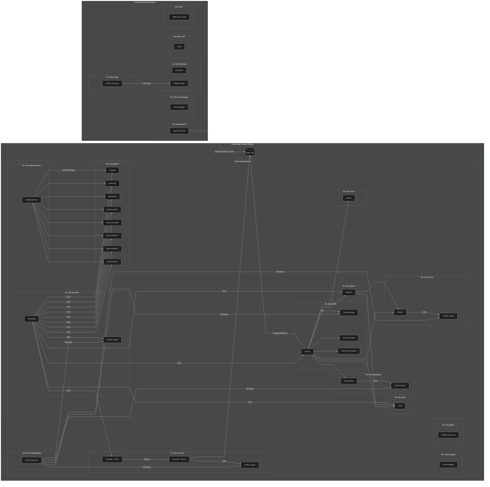

# Installation de la plateforme Cloud π Native <!-- omit in toc -->

## Sommaire <!-- omit in toc -->

- [Introduction](#introduction)
- [Prérequis](#prérequis)
- [Configuration](#configuration)
  - [Utilisation de vos propres values](#utilisation-de-vos-propres-values)
- [Architecture](#architecture)
- [Installation en mode GitOps](#installation-en-mode-gitops)
  - [Prérequis](#prérequis-1)
    - [Configuration du domaine et certificat TLS pour l’Ingress](#configuration-du-domaine-et-certificat-tls-pour-lingress)
      - [Cas 1 : certificat signé par une autorité valide](#cas-1--certificat-signé-par-une-autorité-valide)
      - [Cas 2 : certificat auto-signé](#cas-2--certificat-auto-signé)
  - [Principe d'installation GitOps](#principe-dinstallation-gitops)
  - [Exemple de déploiement GitOps](#exemple-de-déploiement-gitops)
- [Migration vers le déploiement GitOps](#migration-vers-le-déploiement-gitops)
  - [Harbor GitOps](#harbor-gitops)
  - [Nexus GitOps](#nexus-gitops)
- [Déploiement de plusieurs forges DSO dans un même cluster](#déploiement-de-plusieurs-forges-dso-dans-un-même-cluster)
- [Récupération des secrets](#récupération-des-secrets)
- [Debug](#debug)
  - [Cert-manager](#cert-manager)
  - [Kyverno](#kyverno)
  - [Prometheus](#prometheus)
- [Désinstallation](#désinstallation)
  - [Chaîne complète](#chaîne-complète)
  - [Désinstaller un ou plusieurs outils](#désinstaller-un-ou-plusieurs-outils)
- [Gel des versions](#gel-des-versions)
  - [Introduction](#introduction-1)
  - [Modification des versions de charts](#modification-des-versions-de-charts)
  - [Gel des versions d'images](#gel-des-versions-dimages)
    - [Argo CD](#argo-cd)
    - [Cert-manager](#cert-manager-1)
    - [CloudNativePG](#cloudnativepg)
    - [Console Cloud π Native](#console-cloud-π-native)
    - [GitLab](#gitlab)
    - [GitLab CI pipelines exporter](#gitlab-ci-pipelines-exporter)
    - [GitLab Runner](#gitlab-runner)
    - [Harbor](#harbor)
    - [Keycloak](#keycloak)
    - [Kyverno](#kyverno-1)
    - [Sonatype Nexus Repository](#sonatype-nexus-repository)
    - [SonarQube Community Edition](#sonarqube-community-edition)
    - [Vault](#vault)
- [Backups](#backups)
- [Offline / air gap](#offline--air-gap)
- [Platform](#platform)
- [Profile CIS](#profile-cis)
- [Utilisation de credentials Docker Hub pour le pull des images](#utilisation-de-credentials-docker-hub-pour-le-pull-des-images)
- [Gestion des users Keycloak](#gestion-des-users-keycloak)
- [MFA pour les utilisateurs Keycloak](#mfa-pour-les-utilisateurs-keycloak)
- [Tests d'intégration](#tests-dintégration)
- [Contributions](#contributions)
  - [Les commandes de l'application](#les-commandes-de-lapplication)
  - [Conventions](#conventions)

## Introduction

L'installation de la plateforme Cloud π Native (aussi appelée `DSO` pour `DevSecOps`) s'effectue de manière automatisée avec **Ansible**.

Les éléments déployés seront les suivants :

| Outil | Site officiel |
| -|-|
| Argo CD | <https://argo-cd.readthedocs.io> |
| Cert-manager | <https://cert-manager.io> |
| CloudNativePG | <https://cloudnative-pg.io> |
| Console Cloud π Native | <https://github.com/cloud-pi-native/console> |
| GitLab | <https://about.gitlab.com> |
| gitLab-ci-catalog | <https://github.com/cloud-pi-native/gitlab-ci-catalog> |
| gitLab-ci-pipelines-exporter | <https://github.com/mvisonneau/helm-charts/tree/main/charts/gitlab-ci-pipelines-exporter> |
| GitLab Operator | <https://docs.gitlab.com/operator> |
| GitLab Runner | <https://docs.gitlab.com/runner> |
| Grafana (optionnel) | <https://grafana.com> |
| Harbor | <https://goharbor.io> |
| HashiCorp Vault | <https://www.vaultproject.io> |
| Keycloak | <https://www.keycloak.org> |
| Kyverno | <https://kyverno.io> |
| Prometheus Operator CRDs (optionnel) | <https://github.com/prometheus-operator/prometheus-operator/releases><br>Fichier `stripped-down-crds.yaml` disponible dans les Assets de chaque version. |
| SonarQube Community Edition | <https://www.sonarsource.com/open-source-editions/sonarqube-community-edition> |
| Sonatype Nexus Repository | <https://www.sonatype.com/products/sonatype-nexus-repository> |

Certains outils peuvent prendre un peu de temps pour s'installer. Ce sera le cas de Keycloak, Nexus, SonarQube et en particulier GitLab.

Vous pouvez trouver la version des outils installés dans le fichier [versions.md](versions.md).

Comme précisé dans le tableau ci-dessus, certains éléments sont optionnels :
* L'opérateur Grafana et l'instance Grafana ne s'installeront que sur demande explicite, via l'utilisation des tags appropriés. Ceci afin de vous permettre d'opter ou non pour cette solution d'affichage des métriques.
* Les CRDs de l'opérateur Prometheus ne s'installent que s'il est déjà présent dans le cluster (paramètre `managed` dans notre configuration).

## Prérequis

Cette installation s'effectue par défaut dans un cluster [OpenShift](https://www.redhat.com/fr/technologies/cloud-computing/openshift) opérationnel et correctement démarré.

La plateforme [Kubernetes](https://kubernetes.io/fr/) ([vanilla](https://fr.wikipedia.org/wiki/Logiciel_vanilla)) est également supportée si besoin, via l'option de configuration `global.platform` (cf. section [Configuration](#configuration) ci-dessous).

Un tableau synoptique des prérequis minimaux, pour chaque outil positionné dans votre cluster, est proposé dans le fichier [cluster-requirements.md](cluster-requirements.md).

Vous devrez disposer d'un **accès administrateur au cluster**.

Vous aurez besoin d'une machine distincte du cluster, tournant sous GNU/Linux avec une distribution de la famille Debian ou Red Hat. Cette machine vous servira en tant qu'**environnement de déploiement** [Ansible control node](https://docs.ansible.com/ansible/latest/network/getting_started/basic_concepts.html#control-node). Elle nécessitera donc l'installation d'[Ansible](https://docs.ansible.com/ansible/latest/installation_guide/intro_installation.html), **en version supérieure ou égale à 12**, pour disposer au moins de la commande `ansible-playbook` ainsi que de la collection [community.general](https://github.com/ansible-collections/community.general) à jour.

Toujours sur votre environnement de déploiement, vous devrez :

- Clôner le présent [dépôt](https://github.com/cloud-pi-native/socle).
- Disposer d'un fichier de configuration `~/.kube/config` paramétré avec les accès administrateur, pour l'appel à l'API du cluster (section users du fichier en question).

L'installation de la suite des prérequis **sur l'environnement de déploiement** s'effectue à l'aide du playbook nommé `install-requirements.yaml`. Il est mis à disposition dans le répertoire `admin-tools` du dépôt socle que vous aurez clôné.

Si l'utilisateur avec lequel vous exécutez ce playbook dispose des droits sudo sans mots de passe (option `NOPASSWD` du fichier sudoers), vous pourrez le lancer directement sans options :

```bash
ansible-playbook admin-tools/install-requirements.yaml
```

Sinon, vous devrez utiliser l'option `-K` (abréviation de l'option `--ask-become-pass`) qui vous demandera le mot de passe sudo de l'utilisateur :

```bash
ansible-playbook -K admin-tools/install-requirements.yaml
```

Pour information, le playbook `install-requirements.yaml` vous installera les éléments suivants **sur l'environnement de déploiement** :

- Le paquet requis pour bénéficier de la commande `htpasswd` (utilisée pour encrypter le mot de passe d'Argo CD), soit :
  - apache2-utils (distributions Debian et dérivées)
  - httpd-tools (distributions Red Hat et dérivées)

- Paquet requis pour l'installation des modules python :
  - python3-pip

- Paquets requis pour l'installation du gestionnaire de paquets Homebrew :
  - git
  - ruby
  - tar

- Les collections Ansible suivantes :
  -  [kubernetes.core](https://galaxy.ansible.com/ui/repo/published/kubernetes/core/)
  -  [community.hashi_vault](https://galaxy.ansible.com/ui/repo/published/community/hashi_vault)

- Gestionnaire de paquets [Homebrew](https://brew.sh/) pour une installation simplifiée des prérequis restants sur la plupart des distributions GNU/Linux utilisables en production. Testé sous Debian, Ubuntu, Red Hat Enterprise Linux et Rocky Linux.

- Commandes installées avec Homebrew :
  - [helm](https://helm.sh/docs/intro/install/)
  - [k9s](https://k9scli.io/topics/install/) (utile pour debug et administration)
  - [kubectl](https://kubernetes.io/docs/tasks/tools/install-kubectl-linux/)
  - [yq](https://github.com/mikefarah/yq/#install) (utile pour debug et administration)

### Gestion de l'environnement Python (Recommandé avec uv)

Les dépendances Python (incluant Ansible et ses modules requis) doivent être installées. Nous recommandons l'utilisation de [uv](https://docs.astral.sh/uv/) pour gérer cet environnement de manière isolée et reproductible.

1. **Installation de uv** (si nécessaire) :
   ```bash
   curl -LsSf https://astral.sh/uv/install.sh | sh
   ```

2. **Installation des dépendances** :
   À la racine du projet :
   ```bash
   uv sync
   ```
   Cette commande créera un environnement virtuel `.venv` et y installera Ansible ainsi que toutes les librairies Python requises.

3. **Activation de l'environnement** :
   ```bash
   source .venv/bin/activate
   ```

4. **Installation des collections Ansible** :
   Une fois l'environnement activé :
   ```bash
   ansible-galaxy collection install kubernetes.core community.hashi_vault
   ```

> **Note** : Même en utilisant `uv`, vous aurez toujours besoin des outils systèmes (git, tar, etc.) et des binaires (kubectl, helm, etc.) installés par ailleurs (ou via le playbook `install-requirements.yaml`).

## Configuration

Lorsque vous avez cloné le présent dépôt socle, lancez une première fois la commande suivante depuis votre environnement de déploiement :

```bash
ansible-playbook install.yaml
```

Elle vous signalera que vous n'avez encore jamais installé le socle sur votre cluster, puis vous invitera à modifier la ressource de scope cluster et de type `dsc` nommée `conf-dso` via la commande suivante :

```bash
kubectl edit dsc conf-dso
```

Vous pourrez procéder comme indiqué si vous le souhaitez, mais pour des raisons de traçabilité et de confort d'édition vous préférerez peut-être déclarer la ressource `dsc` nommée `conf-dso` dans un fichier YAML, par exemple « ma-conf-dso.yaml », puis la créer via la commande suivante :

```bash
kubectl apply -f ma-conf-dso.yaml
```

Pour vous aider à démarrer, le fichier [cr-conf-dso-default.yaml](roles/socle-config/files/cr-conf-dso-default.yaml) est un **exemple** de configuration également utilisé lors de la première installation. Il surcharge les valeurs par défaut des fichiers [config.yaml](roles/socle-config/files/config.yaml) et [releases.yaml](roles/socle-config/files/releases.yaml). Ce fichier doit être adapté à partir de la section **spec**, en particulier pour les éléments suivants :
* du paramètre `global.rootDomain` (votre domaine principal précédé d'un point),
* des mots de passe de certains outils,
* du paramètre `global.platform` (définir à `kubernetes` si vous n'utilisez pas OpenShift),
* de la taille de certains PVCs,
* de l'activation ou non des métriques,
* du proxy si besoin ainsi que des sections CA et ingress.

Les champs utilisables dans cette ressource de type **dsc** peuvent être décrits pour chaque outil à l'aide de la commande `kubectl explain`. Exemple avec Argo CD :

```shell
kubectl explain dsc.spec.argocd
```

Avant de relancer l'installation avec la dsc configurée, n'hésitez pas à lancer la commande ci-dessus pour obtenir la description de tout champ sur lequel vous avez un doute.

Par ailleurs, les valeurs des helm charts peuvent être surchargées en ajoutant le paramètre `values` au service concerné. Ces `values` dépendent de la [version du helm chart](versions.md) et peuvent être consultées avec la commande `helm show values`. Exemple avec l'opérateur GitLab :

```shell
helm show values gitlab-operator/gitlab-operator --version 2.4.1
```

### Utilisation de vos propres values

Comme nous pouvons le voir dans l'exemple de configuration fourni ci-dessus, plusieurs outils sont notamment configurés à l'aide d'un champ `values`.

Il s'agit de valeurs de chart [Helm](https://helm.sh/fr). Vous pouvez les utiliser ici pour surcharger les valeurs par défaut.

Voici les liens vers les documentations de chart Helm pour les outils concernés :

- [Argo CD](https://github.com/argoproj/argo-helm/tree/main/charts/argo-cd)
- [Console Cloud π Native](https://github.com/cloud-pi-native/console#readme)
- [GitLab](https://gitlab.com/gitlab-org/charts/gitlab)
- [Harbor](https://github.com/goharbor/harbor-helm)
- [Keycloak](https://github.com/bitnami/charts/tree/main/bitnami/keycloak)
- [SonarQube](https://github.com/SonarSource/helm-chart-sonarqube)
- [HashiCorp Vault](https://github.com/hashicorp/vault-helm)

S'agissant du gel des versions de charts ou d'images pour les outils en question, **nous vous invitons fortement à consulter la section détaillée [Gel des versions](#gel-des-versions)** située plus bas dans le présent document.

## Architecture



## Installation en mode GitOps

Nous proposons dès maintenant un mode d'installation s'appuyant sur l'approche [GitOps](https://en.wikipedia.org/wiki/DevOps#GitOps), et reposant sur une application Argo CD qui déploie plusieurs [applicationSets](https://argo-cd.readthedocs.io/en/stable/user-guide/application-set/) par vagues (notion de [sync waves](https://argo-cd.readthedocs.io/en/stable/user-guide/sync-waves/)). Chaque applicationSet déploie lui-même une ou plusieurs applications du Socle, selon la vague à laquelle elles sont rattachées, ceci en fonction d'un environnement donné et des paramètres qui le caractérisent.

Toutes les applications de la chaîne DSO sont désormais gérées en mode GitOps.

### Prérequis

Le mode de déploiement GitOps fait encore appel pour partie à Ansible et nécessite donc les prérequis déjà spécifiés plus haut.

Quatre prérequis supplémentaires sont toutefois à prendre en compte :
* Disposer de **votre propre dépôt Git** dans lequel seront déposés les fichiers utiles à Argo CD. Ce peut-être dans votre propre espace sur GitHub.
* Une instance **Vault d'infrastructure**. Elle sert à stocker les secrets des applications du Socle (mots de passe, URLs, etc.).
* Une instance **Argo CD d'infrastructure**, disposant du [plugin Vault](https://argocd-vault-plugin.readthedocs.io/en/stable/) paramétré pour communiquer avec l'instance Vault d'infrastructure. C'est cette instance d'Argo CD qui utilise l'applicationSet pour déployer les applications du Socle dans le cluster cible.
* Une instance **Keycloak d'infrastructure**, utilisée pour la connexion aux deux outils précédents. Optionnelle mais recommandée en termes de sécurité et de contrôles d'accès.

Pour faciliter l'installation des trois éléments d'infrastructure évoqués ci-dessus, nous proposons des roles dédiés.

Il faudra préalablement que votre CRD soit à jour pour la ressource de type dsc :

```shell
kubectl apply -f roles/socle-config/files/crd-conf-dso.yaml
```
Et que votre resource de configuration `dsc` soit correctement paramétrée pour installer ces éléments d'infrastructure. Exemple (à adapter) :

```yaml
spec:
  argocdInfra:
    admin:
      enabled: true
      password: argocd_admin_password
    installEnabled: true
    namespace: infra-argocd
    subDomain: infra-argocd
    values:
      applicationSet:
        enabled: true
      controller:
        resourcesPreset: large
      crds:
        install: false
  keycloakInfra:
    installEnabled: true
    namespace: infra-keycloak
    postgresPvcSize: 5Gi
    subDomain: infra-keycloak
    values:
      podSecurityContext:
        enabled: true
        fsGroup: 1001
      replicaCount: 2
  vaultInfra:
    installEnabled: true
    namespace: infra-vault
    subDomain: infra-vault
    values: {}
```

Notons que chacune des trois applications d'infrastructure ci-dessus dispose d'un paramètre `installEnabled` qui permet d'indiquer si elle doit être installée ou non. Elles ne le sont pas par défaut (le paramètre `installEnabled` étant positionné à `false`), afin notamment de laisser à nos utilisateurs la liberté de les installer eux-mêmes dans le cluster de leur choix, à l'aide des rôles que nous proposons ou bien de leur propre code de déploiement.

Si vous souhaitez les installer une première fois, il faut donc positionner lors de cette première installation le paramètre `installEnabled` sur la valeur `true`.

Si vous souhaitez installer **keyclock**, pensez à installer cloudnativepg s'il existe pas dans votre cluster

```shell
ansible-playbook install-gitops.yaml -t cloudnativepg
```

Autre point important, le mot de passe admin d'Argo CD (`argocd_admin_password` dans notre exemple ci-dessus) doit être un hash salé que vous pouvez générer à l'aide de la commande suivante :

```shell
htpasswd -nbBC 10 "" votre_mot_de_passe_ici | tr -d ':\n' | sed 's/$2y/$2a/'
```

#### Configuration du domaine et certificat TLS pour l’Ingress

Les applications **d'infrastructure** doivent être exposées via le **domaine configuré** dans la ressource `conf-dso`.
Le cluster doit disposer d’un **Ingress** configuré avec un certificat TLS valide (fourni par une autorité de certification reconnue).

##### Cas 1 : certificat signé par une autorité valide
Aucune configuration supplémentaire n’est nécessaire, l’Ingress est directement utilisable.

##### Cas 2 : certificat auto-signé
Si vous utilisez un certificat auto-signé, vous devez exposer la **CA racine** pour que les autres composants puissent valider ce certificat.
Pour cela, ajoutez la CA racine dans un `Secret` ou un `ConfigMap`, puis référencez-le dans le champ `exposedCA` de la ressource `DSC`.

Exemple avec un Secret :

```yaml
apiVersion: v1
kind: Secret
metadata:
  name: root-ca
  namespace: ingress-nginx
type: Opaque
stringData:
  ca: |
    -----BEGIN CERTIFICATE-----
    MIID...
    -----END CERTIFICATE-----
```

Et puis dans la configuration `dsc`:

```yaml
apiVersion: dso.cloud-pi-native.io/v1alpha1
kind: DSC
metadata:
  name: conf-dso
spec:
  exposedCA:
    type: secret
    secret:
      namespace: ingress-nginx
      name: root-ca
      key: ca
```

Vous pourrez alors installer les trois instances requises de vos outils d'infrastructure à l'aide du playbook `install-gitops.yaml`.

Si vous avez adapté la configuration `dsc` par défaut (nommée `conf-dso`), la commande sera la suivante :

```yaml
ansible-playbook install-gitops.yaml -t keycloak-infra,vault-infra,argocd-infra
```

Si vous avez utilisé votre propre resource `dsc`, vous la préciserez via la variable supplémentaire habituelle (exemple à adapter avec le nom de votre `dsc`) :

```yaml
ansible-playbook install-gitops.yaml -t keycloak-infra,vault-infra,argocd-infra -e dsc_cr=ma-conf-dsc
```

### Principe d'installation GitOps

L'installation en mode GitOps est à lancer à l'aide du playbook `install-gitops.yaml`.

Ce playbook fait notamment appel aux roles suivants, situés dans `roles/gitops` :
* `local-config` : s'assure que vous avez bien déclaré les variables d'environnement nécessaires à l'exécution de l'installation. Il vous prévient si ce n'est pas le cas, et positionne également les facts associés qui seront utilisés au cours de l'installation.
* `vault-secrets` : sert à peupler le Vault d'infrastructure avec les values de secrets pour notre environnement et les applications associées.
* `rendering-apps-files` : permet de générer les fichiers de charts Helm des applications du Socle, ainsi que les values et templates associés dans le répertoire `gitops/envs/nom_de_notre_environnement/apps` du clone local de votre dépôt Git. Le role tient compte des paramètres de votre `dsc` lors de la génération, et ajuste le contenu des fichiers en conséquence.
* `watchpoint` : sert à arrêter le playbook suite à la génération des fichiers de charts, afin de permettre un passage en revue par l'utilisateur avant que ce-dernier n'effectue si besoin un `git push` des changements. Affiche un message en ce sens. Il s'agit du comportement par défaut, contôlé par le paramètre `spec.global.gitOps.watchpointEnabled` de la dsc (positionné à `true` par défaut).
* `dso-app` : déploie l'application `dso-install-manager` dans le namespace de l'Argo CD d'infrastructure en se basant sur le fichier `roles/gitops/dso-app/templates/dso-app.yaml.j2`. La création de cette Application dans Argo CD viendra consommer les applicationSets générés à l'aide du template `roles/gitops/dso-app/templates/dso-appset.yaml.j2` et déposés dans votre dépôt Git utilisé pour le déploiement GitOps. Ceci permet notamment de rendre les applicationSets visibles dans la web UI d'Argo CD. Ce sont ensuite ces mêmes applicationSets qui déploient par vagues les applications du Socle, en allant lire les fichiers JSON se trouvant dans les sous-répertoires de `gitops/envs` qui correspondent à nos environnements. Notons que **le nom d'un environnement doit impérativement correspondre à celui d'une resource `dsc` de configuration, définie dans votre cluster de déploiement**. Par exemple, l'environnement par défaut nommé `conf-dso` correspondra à votre dsc par défaut également nommée `conf-dso`.

Vous constaterez aussi la présence de roles situés dans le répertoire `./roles/gitops/post-install` et qui servent à lancer des tasks de post installation pour les outils concernés. Ces roles sont lus et exécutés à l'aide de jobs Argo CD de post-install, générés pour chacun des outils qui le nécessitent. Les jobs exécutent le chart Helm [cpn-ansible-job](https://github.com/cloud-pi-native/helm-charts/tree/main/charts/dso-ansible-job), positionné en tant que dépendance de chart des outils en question dans votre dépôt Git.

Notez également que la crd et la dsc sont systématiquement poussées dans l'application `global`, et se trouveront donc par défaut aux emplacements suivants dans votre dépôt local GitOps :
- `./gitops/envs/conf-dso/apps/global/crds/dsc-crd.yaml`
- `./gitops/envs/conf-dso/apps/global/templates/dsc.yaml`

Ainsi, suite à une première installation réussie, ces deux éléments peuvent être gérés directement en mode GitOps (par édition des fichiers puis push) et sont de fait versionnés.

### Exemple de déploiement GitOps

Nous allons déployer l'instance Keycloak de la chaîne DSO, à l'aide de la dsc `conf-dso` et du code de déploiement GitOps.

Comme vu dans les prérequis, vous devez disposer de votre propre dépot Git.

Pour déployer :
* Créez préalablement votre dépôt à vide dans votre instance GitHub (ou GitLab). Vous pouvez le nommer `mon-repo-gitops`, ou tout autre nom à votre convenance.
* Clonez votre dépôt vide localement.
* Positionnez-vous dans le répertoire `socle` de votre dépôt (ou tout autre nom que vous avez choisi) et vérifiez l'existence de la branche `main` via la commande `git branch`.
* Positionnez-vous dans un répertoire distinct de votre dépôt local. Ce peut être par exemple votre répertoire habituel de téléchargement.
* Lancez la commande `git clone https://github.com/cloud-pi-native/socle.git` afin de cloner le présent dépôt du Socle dans cet autre répertoire.
* Positionnez-vous dans le répertoire `socle` du présent dépôt que vous venez de cloner, et assurez vous d'être bien positionné sur la branche `main` à l'aide de la commande `git branch`. Listez également les fichiers présents.
* Créez une variable d'environnement avec `export GITOPS_REPO_PATH=/chemin/absolu/vers/votre/dépôt`.
* Créez une variable d'environnement avec `export KUBECONFIG_INFRA=/chemin/absolu/vers/votre/kubeconfig-infra` pour configurer les accès au cluster d'infrastructure.
* (Optionnel) Créez une variable d'environnement avec `export KUBECONFIG_PROXY_INFRA=http://127.0.0.1:<port>` en cas d'utilisation de `tsh proxy kube --port <port>`.
* (Optionnel) Créez une variable d'environnement avec `export VAULT_INFRA_DOMAIN=<nom de domaine du vault d'infrastructure>` en cas de permissions restreintes sur le cluster d'infrastructure.
* (Optionnel) Créez une variable d'environnement avec `export VAULT_INFRA_TOKEN=<token du vault d'infrastructure>` en cas de permissions restreintes sur le cluster d'infrastructure.
* Lancez le playbook `install-gitops.yaml` pour peupler votre clone local : `ansible-playbook install-gitops.yaml`.
* Effectuez votre premier commit sur la branche main de votre dépôt, exemple : `git commit -am "feat: first-commit"`
* Poussez vos changements sur la branche main distante : `git push`

Vous pouvez vérifier que votre branche main locale est effectivement à jour par rapport à son homologue distante, via la commande  suivante :

`git status`

Vous devriez alors obtenir une sortie similaire à ceci :

Sur la branche main
Votre branche est à jour avec 'origin/main'.

rien à valider, la copie de travail est propre
```

Dans votre dépôt, créez une branche de déploiement, exemple :

```shell
git checkout -b ma-branche
```

Rappel : Assurez-vous préalablement que votre CRD est à jour pour la définition des ressources de type dsc.

```shell
kubectl apply -f roles/socle-config/files/crd-conf-dso.yaml
```

Passez en revue la ressource dsc de configuration `conf-dso` pour paramétrer le déploiement, en particulier la section `spec.keycloak` puisque c'est cette application du Socle que nous déployons ici à titre d'exemple.

Vérifiez aussi que le paramètre `spec.global.gitOps.watchpointenabled` est bien positionné à `true`.

Dans le dépôt GitOps en local, toujours dans votre branche, positionnez-vous dans le répertoire `gitops/envs` puis dans le sous-répertoire correspondant à l'environnement cible, lequel, pour rappel, **doit impérativement correspondre au nom de votre dsc**.

Dans notre exemple, vous déployez Keycloak avec la dsc par défaut `conf-dso`. Le sous-répertoire `gitops/envs/conf-dso` existe donc déjà. Positionnez-vous dans ce sous-répertoire puis éditez le fichier `conf-dso.json` qui par défaut se présente ainsi :

```json
{
  "env": "conf-dso",
  "provider": "self-hosted",
  "region": "fr-par",
  "customNamespacePrefix": "dso-",
  "destination": {
    "clusterName": ""
  },
  "targetRevision": "main",
  "apps": [
    {
      "app": "global",
      "enabled": true,
      "clusterName": "",
      "namespace": "global",
      "customNamespacePrefix": "",
      "syncWave": 10
    },
    {
      "app": "certmanager",
      "enabled": false,
      "clusterName": "",
      "namespace": "certmanager",
      "customNamespacePrefix": "",
      "syncWave": 10
    },
    {
      "app": "kyverno",
      "enabled": false,
      "clusterName": "",
      "namespace": "kyverno",
      "customNamespacePrefix": "",
      "syncWave": 10
    },
    {
      "app": "keycloak",
      "enabled": true,
      "clusterName": "",
      "namespace": "keycloak",
      "customNamespacePrefix": "",
      "syncWave": 20
    },
    {
      "app": "gitlab",
      "enabled": true,
      "clusterName": "",
      "namespace": "gitlab",
      "customNamespacePrefix": "",
      "syncWave": 30
    },
    {
      "app": "glexporter",
      "enabled": true,
      "clusterName": "",
      "namespace": "gitlab",
      "customNamespacePrefix": "",
      "syncWave": 40
    },
    {
      "app": "gitlabrunner",
      "enabled": true,
      "clusterName": "",
      "namespace": "gitlab",
      "customNamespacePrefix": "",
      "syncWave": 40
    },
    {
      "app": "vault",
      "enabled": true,
      "clusterName": "",
      "namespace": "vault",
      "customNamespacePrefix": "",
      "syncWave": 40
    },
    {
      "app": "harbor",
      "enabled": true,
      "clusterName": "",
      "namespace": "harbor",
      "customNamespacePrefix": "",
      "syncWave": 50
    },
    {
      "app": "argocd",
      "enabled": true,
      "clusterName": "",
      "namespace": "argocd",
      "customNamespacePrefix": "",
      "syncWave": 50
    },
    {
      "app": "nexus",
      "enabled": true,
      "clusterName": "",
      "namespace": "nexus",
      "customNamespacePrefix": "",
      "syncWave": 50
    },
    {
      "app": "sonarqube",
      "enabled": true,
      "clusterName": "",
      "namespace": "sonarqube",
      "customNamespacePrefix": "",
      "syncWave": 50
    },
    {
      "app": "console",
      "enabled": true,
      "clusterName": "",
      "namespace": "console",
      "customNamespacePrefix": "",
      "syncWave": 60
    },
    {
      "app": "observability",
      "enabled": false,
      "clusterName": "in-cluster",
      "namespace": "argo",
      "customPrefix": "infra-",
      "syncWave": 60
    }
  ]
}
```

Passez en revue les paramètres de ce fichier, et notamment :
* `env` : doit correspondre au nom de l'environnement tel qu'indiqué dans le répertoire `gitops/envs/conf-dso` et dans lequel se trouve le fichier `conf-dso.json`, qui est-lui même nommé d'après le nom de ce même environnement. Ce nom doit également correspondre au nom de la `dsc` que vous utilisez (spécifié via le paramètre `metadata.name` de cette même dsc). Il y a donc **correspondance rigoureuse** entre le nom de l'environnement utilisé ici par le paramètre `env` et celui de la `dsc`. Ce même nom doit se retrouver impérativement dans le nom du répertoire de l'environnement (soit dans notre exemple `gitops/envs/conf-dso`) et celui du fichier de configuration JSON associé (`conf-dso.json`). Sans ces correspondances strictes, l'installation échouera.
* `customNamespacePrefix` : Il s'agit ici du péfixe de vos namespaces. Ce préfixe doit impérativement se retrouver dans tous les paramètres `namespace` des outils spécifiés dans votre `dsc`, à l'exception des outils d'infrastructure vus précédemment et qui ne sont pas installés en mode GitOps.
* `destination.clustername` : Si votre Argo CD d'infrastructure n'est pas installé dans le même cluster que le cluster de destination vers lequel vous déployez, préciser alors ici le nom du cluster de destination tel qu'il est connu par votre Argo CD d'infrastructure. S'il est installé dans le même cluster, vous pouvez indiquer "in-cluster".
* `targetRevision` : Il s'agit du nom de la branche à partir de laquelle vous déployez et depuis laquelle votre instance Argo CD d'infrastructure va aller tirer les fichiers. Dans notre exemple, vous le modifierez et le remplacerez par "ma-branche".
* `apps` : Ce paramètre est un array qui contient lui-même des objets correspondant chacun à l'une des applications du Socle qui seront déployées, ainsi qu'aux paramètres de cette application lus par les applicationSets Argo CD (`gitops/dso-appset-wave-XX.yaml`). Nous voyons ici que la ligne correspondant à l'application keycloak comprend le paramètre `enabled` positionné à `true`. Ce paramètre est **très important** puisqu'il détermine si une application est installée (`true`) ou pas (`false`). Veuillez noter que si ce paramètre est positionné à `false` et que l'application en question est déjà installée et gérée par notre applicationSet, **alors elle est désinstallée**. Notons aussi la présence du paramètre `namespace`, qui indique le nom du namespace hors préfixe. Il en résulte qu'ici l'application keycloak sera finalement déployée dans le namespace "dso-keycloak", le préfixe venant s'ajouter au nom du namespace.

Compte-tenu des éléments que nous venons de vérifier, et si nous voulons bien déployer uniquement Keycloak dans le namespace dso-keycloak, avec un Argo CD d'infrastructure également présent dans le cluster cible, alors notre fichier `gitops/envs/conf-dso/conf-dso.json`, tenant compte de notre branche de déploiement, se présentera finalement ainsi après édition :

```json
{
  "env": "conf-dso",
  "provider": "self-hosted",
  "region": "fr-par",
  "customNamespacePrefix": "dso-",
  "destination": {
    "clusterName": "in-cluster"
  },
  "targetRevision": "ma-branche",
  "apps": [
    {
      "app": "global",
      "enabled": true,
      "clusterName": "",
      "namespace": "global",
      "customNamespacePrefix": "",
      "syncWave": 10
    },
    {
      "app": "certmanager",
      "enabled": false,
      "clusterName": "",
      "namespace": "certmanager",
      "customNamespacePrefix": "",
      "syncWave": 10
    },
    {
      "app": "kyverno",
      "enabled": false,
      "clusterName": "",
      "namespace": "kyverno",
      "customNamespacePrefix": "",
      "syncWave": 10
    },
    {
      "app": "keycloak",
      "enabled": true,
      "clusterName": "",
      "namespace": "keycloak",
      "customNamespacePrefix": "",
      "syncWave": 20
    },
    {
      "app": "gitlab",
      "enabled": false,
      "clusterName": "",
      "namespace": "gitlab",
      "customNamespacePrefix": "",
      "syncWave": 30
    },
    {
      "app": "glexporter",
      "enabled": false,
      "clusterName": "",
      "namespace": "gitlab",
      "customNamespacePrefix": "",
      "syncWave": 40
    },
    {
      "app": "gitlabrunner",
      "enabled": false,
      "clusterName": "",
      "namespace": "gitlab",
      "customNamespacePrefix": "",
      "syncWave": 40
    },
    {
      "app": "vault",
      "enabled": false,
      "clusterName": "",
      "namespace": "vault",
      "customNamespacePrefix": "",
      "syncWave": 40
    },
    {
      "app": "harbor",
      "enabled": false,
      "clusterName": "",
      "namespace": "harbor",
      "customNamespacePrefix": "",
      "syncWave": 50
    },
    {
      "app": "argocd",
      "enabled": false,
      "clusterName": "",
      "namespace": "argocd",
      "customNamespacePrefix": "",
      "syncWave": 50
    },
    {
      "app": "nexus",
      "enabled": false,
      "clusterName": "",
      "namespace": "nexus",
      "customNamespacePrefix": "",
      "syncWave": 50
    },
    {
      "app": "sonarqube",
      "enabled": false,
      "clusterName": "",
      "namespace": "sonarqube",
      "customNamespacePrefix": "",
      "syncWave": 50
    },
    {
      "app": "console",
      "enabled": false,
      "clusterName": "",
      "namespace": "console",
      "customNamespacePrefix": "",
      "syncWave": 60
    },
    {
      "app": "observability",
      "enabled": false,
      "clusterName": "in-cluster",
      "namespace": "argo",
      "customPrefix": "infra-",
      "syncWave": 60
    }
  ]
}
```

Finalement, nous lançons une première fois notre installation en GitOps de l'application Keycloak, s'appuyant sur la dsc `conf-dso` (configuration par défaut) via la commande suivante :

```shell
ansible-playbook install-gitops.yaml
```

Ce premier lancement exécutera les tâches passées en revue plus haut et s'arrêtera en affichant le message suivant :

```shell
ok: [localhost] => {
    "msg": [
        "Paramètre global.gitOps.watchpointEnabled positionné à true dans votre resource dsc 'conf-dso'.",
        "Arrêt de l'installation suite à génération automatique des fichiers d'applications pour l'environnement 'conf-dso'.",
        "",
        "Veuillez vous assurer de la cohérence des fichiers générés dans le répertoire '/chemin/absolu/vers/votre/dépôt/gitops/envs/conf-dso/apps'.",
        "",
        "Vous devrez par ailleurs adapter le fichier '/chemin/absolu/vers/votre/dépôt/gitops/envs/conf-dso/conf-dso.json'",
        "afin d'y ajuster les paramètres souhaités. Se référer à la documentation README à ce sujet.",
        "",
        "Assurez-vous également de la cohérence des secrets qui ont été générés dans votre instance Vault d'infrastructure,",
        "au niveau du secret engine 'dso-<dsc.global.gitOps.envName>', pour l'environnement 'conf-dso'.",
        "",
        "Une fois ces vérifications et ajustements réalisés, poussez les fichiers modifiés dans votre dépôt Git (via 'git push').",
        "",
        "Pour finir vous pouvez soit :",
        "- Lancer le role d'installation restant via le tag 'dso-app'.",
        "- Positionner le paramètre global.gitOps.watchpointEnabled à false dans",
        "  votre resource dsc 'conf-dso' puis relancer une installation complète."
    ]
}
```

Suivre les indications fournies.

Vous devrez prêter une **attention particulière** à l'étape de vérification des secrets dans votre instance Vault d'infrastructure.

En effet, plusieurs secrets auront été générés à vide car il s'agit d'informations externes à la solution, et que vous êtes seul(e) en capacité de fournir.

Il s'agit des secrets suivants qui se situent par défaut dans le secret engine `dso-<dsc.global.gitOps.envName>/env/conf-dso/apps` (chemin dans lequel `dsc.global.gitOps.envName` est à substituer avec l'`envName` qui se trouve dans votre `dsc`).

`global/values` :

```
{
  "backup": {
    "s3AccessKey": "",
    "s3SecretKey": ""
  },
  "dockerAccount": {
    "password": "",
    "username": ""
  },
  "smtp": {
    "authentication": {
      "password": "",
      "user": ""
    }
  },
…
}
```

`harbor/values` :

```
{
  "global": {
     "proxyCache": [
      {
        "name": "dockerhub",
        "registry": {
          "credential": {
            "accessKey": "",
            "accessSecret": "",
          },
…
        }
      }
    ],
    "s3ImageChartStorage": {
      "accesskey": "",
      "secretkey": ""
    }
  }
}
```

En résumé, il vous faudra renseigner si besoin, et en complément de ce que vous aurez déjà indiqué dans votre `dsc` :
- Pour l'app `global`, vos credentials :
  - Stockage S3
  - Docker Hub
  - SMTP
- Pour l'app `harbor`, vos credentials :
  - Stockage S3
  - Docker Hub

Afin de vous faciliter cette étape, nous proposons le playbook `credentials-to-vault.yaml` situé dans le répertoire `admin-tools`.

Pour le lancer en utilisant la configuration par défaut (dsc `conf-dso`) :

```shell
ansible-playbook admin-tools/credentials-to-vault.yaml
```

Il créera pour vous le fichier `/tmp/my-credentials.yaml` qu'il vous invitera à remplir avant de relancer le playbook.

Une fois ce fichier rempli avec les credentials souhaités pour la partie dont vous avez besoin (S3, Docker Hub et/ou SMTP), relancez simplement le playbook qui ira remplir pour vous les secrets correspondants dans votre Vault d'infrastructure :

```shell
ansible-playbook admin-tools/credentials-to-vault.yaml
```

Notez qu'il vous aura également demandé de remplir la variable d'environnement `KUBECONFIG_INFRA` (vue plus haut) qui lui servira pour aller récupérer le token de votre Vault d'infrastructure. Il est également possible de lui fournir plusieurs autres variables d'environnement vues précédemment si besoin, à savoir `KUBECONFIG_PROXY_INFRA`, `VAULT_INFRA_DOMAIN` et `VAULT_INFRA_TOKEN`.

Une fois le playbook `credentials-to-vault.yaml` exécuté si nécessaire, pensez à supprimer le fichier `/tmp/my-credentials.yaml`.

Lorsque vous avez terminé les vérifications requises vues précédemment (cohérences des fichiers générés et des secrets Vault), poussez les changements sur votre branche "ma-branche" :

```shell
git ls-files --modified | xargs git add
```

```shell
git commit -m "chore: adapt gitops conf-dso files"
```

```shell
git push --set-upstream origin ma-branche
```

---

**Remarque**

Avant de poursuivre, assurez-vous d'avoir configuré dans l'Argo CD d'infrastructure votre dépôt GitOps (`mon-repo-gitops` ou tout autre nom que vous aurez choisi), lequel est très probablement un dépôt privé. Sinon l'application `dso-install-manager` remontera l'erreur suivante :

```
Failed to load target state: failed to generate manifest for source 1 of 1: rpc error: code = Unknown desc = failed to list refs: repository not found: Repository not found.
```

La configuration d'un dépôt privé peut s'effectuer avec l'interface web d'Argo CD, via le menu `Settings` puis `Repositories` (bouton `+ CONNECT REPO`).

En principe, pour une connexion de type `via HTTP\HTTPS`, spécifier uniquement le `Repository URL` et les credentials approprés sera suffisant.

Référez-vous à la [documentation officielle d'Argo CD](https://argo-cd.readthedocs.io/en/stable/user-guide/private-repositories/) sur le sujet.

---

Puis lancer la suite de l'installation gitOps à l'aide du tag `-t dso-app` :

```shell
ansible-playbook install-gitops.yaml -t dso-app
```

Nous devrions voir l'application `dso-install-manager` ainsi que notre instance de Keycloak se déployer dans l'interface web de notre instance Argo CD d'infrastructure.

Pour rappel, si vous avez utilisé le role que nous proposons pour son installation, vous pourrez retrouver les identifiants de votre instance Argo CD d'infrastructure à l'aide du playbook d'administration lancé comme suit (à adapter avec la variable `-e dsc_cr=votre-dsc` si vous avez utilisé une autre `dsc` que `conf-dso` pour son installation) :

```shell
ansible-playbook admin-tools/get-credentials.yaml -t argo-infra
```

Une fois Keycloak déployé, sa post-configuration s'effectuera automatiquement, via le job de post-install.

Celui-ci peut être relancé autant de fois que souhaité, en cliquant sur le bouton `Sync` de l'application Keycloak dans l'Argo CD d'infrastructure.

## Migration vers le déploiement GitOps

:warning: Assurez-vous de ne pas perdre le mot de passe admin de Nexus avant d'effectuer la synchronisation Argo CD.

Après la synchronisation Argo CD, pour tous les services, il sera nécessaire de supprimer les deployments, statefulsets et jobs parce qu'il y a nécessité de modification des champs immuables `spec.selector.matchLabels` lors de la prise d'ownership d'Argo CD.
Ceci peut être fait avec la commande suivante en se positionnant sur les namespaces concernés.
```shell
kubectl config set-context --current --namespace=<namespace>
kubectl get deploy | grep -v NAME | awk '{print $1}' | xargs --no-run-if-empty kubectl delete deploy && kubectl get sts | grep -v NAME | awk '{print $1}' | xargs --no-run-if-empty kubectl delete sts && kubectl get job | grep -v NAME | awk '{print $1}' | xargs --no-run-if-empty kubectl delete job
```

### Harbor GitOps

En cas d'utilisation de `imageChartStorage` dans la `dsc` comme suit.
```yaml
harbor:
  values:
    persistence:
      imageChartStorage:
        s3:
          accesskey: <accesskey>
          bucket: <bucket>
          region: <region>
          regionendpoint: <regionendpoint>
          secretkey: <secretkey>
        type: s3
```
Il faut supprimer et remplacer par ce qui suit.
```yaml
harbor:
  s3ImageChartStorage:
    enabled: true
    accesskey: <accesskey>
    bucket: <bucket>
    region: <region>
    regionendpoint: <regionendpoint>
    secretkey: <secretkey>
```
Puis lancer le playbook d'insertion des secrets dans le Vault d'infrastructure.
```shell
ansible-playbook install-gitops.yaml -t vault-secrets
```

### Nexus GitOps

Il y a une migration de données à faire. Pour cela, il faut modifier le Statefulset Nexus de la manière suivante (désactiver l'auto-sync sur Argo CD si nécessaire) :
- monter l'ancien volume existant,
- modifier l'image du Statefulset et ajouter la commande de `sleep infinity` pour maintenir le conteneur en vie sans que Nexus ne s'exécute.
```yaml
spec:
  template:
    spec:
      [...]
      containers:
        image: busybox
        command: ["sleep", "infinity"]
        [...]
        volumeMounts:
        - mountPath: /nexus-data-claim
          name: nexus-data-claim
      [...]
      volumes:
      - name: nexus-data-claim
        persistentVolumeClaim:
          claimName: nexus-data-claim
```
Une fois le pod en `running 3/4`, il faudra exec dans le pod et faire la copie des répertoires suivants.
```
cp -rp /nexus-data-claim/blobs /nexus-data/
cp -rp /nexus-data-claim/db /nexus-data/
cp -rp /nexus-data-claim/etc /nexus-data/
cp -rp /nexus-data-claim/keystores /nexus-data/

# Optionnel:
cp -rp /nexus-data-claim/log /nexus-data/
cp -rp /nexus-data-claim/cache /nexus-data/
cp -rp /nexus-data-claim/elasticsearch /nexus-data/
```
Synchroniser l'application Argo CD pour que Nexus démarre avec les données migrées et supprimer l'ancien pvc (assurez-vous que le mot de passe Admin sur Vault soit bien celui d'avant migration).

## Déploiement de plusieurs forges DSO dans un même cluster

Suite à une première installation réussie et selon vos besoins, il est possible, selon sa capacité, d'installer dans un même cluster une ou plusieurs autres forges DSO, en parallèle de celle installée par défaut.

Pour cela, il vous suffit de déclarer une **nouvelle ressource de type dsc dans le cluster**, en la nommant différemment de la ressource `dsc` par défaut qui pour rappel se nomme `conf-dso`, et en y modifiant les éléments souhaités.

Comme vu plus haut dans la section [Configuration](#configuration), déclarez votre ressource de type `dsc` personnalisée **dans un fichier YAML**.

Il s'agira simplement de **modifier le nom de la ressource dsc** (section `metadata`, champ `name`) puis **adapter les paramètres souhaités** (mots de passe, ingress, CA, proxy, values …).

Pensez également à déclarer pour chaque outil **un `namespace` et un `subDomain` différents** de ceux déjà déclarés lors de la première installation du socle DSO.

Exemple pour Argo CD :

```yaml
argocd:
  namespace: mynamespace-argocd
  subDomain: argocd-perso
  admin:
    enabled: true
    password: PasswordForEveryone
```

Pour mémoire, les namespaces et subDomains par défaut, déclarés lors de la première installation du socle, peuvent être listés en se positionnant préalablement dans le répertoire socle, puis en affichant le fichier « config.yaml » du role socle-config, exemple en ligne de commande :

```bash
cat ./roles/socle-config/files/config.yaml
```

Lorsque votre nouvelle configuration est prête, et déclarée par exemple dans le fichier « ma-conf-perso.yaml », créez-la dans le cluster comme ceci :

```bash
kubectl apply -f ma-conf-perso.yaml
```

Vous pourrez ensuite la retrouver via la commande :

```bash
kubectl get dsc
```

Puis éventuellement l'afficher (exemple avec une `dsc` nommée `ma-dsc`) :

```bash
kubectl get dsc ma-dsc -o yaml
```

Dès lors, il vous sera possible de déployer une nouvelle chaîne DSO dans ce cluster, en plus de celle existante. Pour cela, vous utiliserez l'[extra variable](https://docs.ansible.com/ansible/latest/playbook_guide/playbooks_variables.html#defining-variables-at-runtime) Ansible prévue à cet effet, nommée `dsc_cr` (pour DSO Socle Config Custom Resource).

Par exemple, si votre nouvelle ressource `dsc` se nomme `ma-dsc`, alors vous lancerez l'installation correspondante comme ceci :

```bash
ansible-playbook install-gitops.yaml -e dsc_cr=ma-dsc
```

Pendant l'installation, et si vous avez nommé vos namespaces en utilisant un même suffixe ou préfixe, vous pourrez surveiller l'arrivée de ces namespaces dans le cluster.

Exemple avec des namespaces préfixés `mynamespace-` :

```bash
watch "kubectl get ns | grep 'mynamespace-'"
```

Exemple avec des namespaces dont le suffixe est `-mynamespace` :

```bash
watch "kubectl get ns | grep '\-mynamespace'"
```

## Récupération des secrets

Au moment de leur initialisation, certains outils stockent des secrets qui ne sont en principe plus disponibles ultérieurement.

**Attention !** Pour garantir l'[idempotence](https://fr.wikipedia.org/wiki/Idempotence), ces secrets sont stockés dans plusieurs ressources du cluster. Supprimer ces ressources **indique à Ansible qu'il doit réinitialiser les composants associés**.

Afin de faciliter la récupération des secrets, un playbook d'administration nommé `get-credentials.yaml` est mis à disposition dans le répertoire `admin-tools/`.

Pour le lancer :

```bash
ansible-playbook admin-tools/get-credentials.yaml
```

Ce playbook permet également de cibler un outil en particulier, grâce à l'utilisation de tags qui sont listés au début de l'exécution, exemple avec keycloak :

```bash
ansible-playbook admin-tools/get-credentials.yaml -t keycloak
```

Enfin, dans le cas où plusieurs chaînes DSO sont déployées dans le même cluster, il permet de cibler la chaîne DSO voulue via l'utilisation de l'[extra variable](https://docs.ansible.com/ansible/latest/playbook_guide/playbooks_variables.html#defining-variables-at-runtime) `dsc_cr`, exemple avec une chaîne utilisant la `dsc` nommée `ma-conf` :

```bash
ansible-playbook admin-tools/get-credentials.yaml -e dsc_cr=ma-conf
```

Et bien sûr cibler un ou plusieurs outils en même temps, via les tags. Exemple :

```bash
ansible-playbook admin-tools/get-credentials.yaml -e dsc_cr=ma-conf -t keycloak,argocd
```

**Remarque importante** : Il est **vivement encouragé** de **sauvegarder les valeurs** qui vous sont fournies par le playbook `get-credentials.yaml`. Par exemple dans un fichier de base de données chiffré de type KeePass, Vaultwarden ou Bitwarden. Il est toutefois important de **ne pas les modifier ou les supprimer** sous peine de voir certains composants, par exemple Vault, être réinitialisés.

## Debug

### Cert-manager

L'outil cert-manager est installé à l'aide de son [chart helm officiel](https://cert-manager.io/docs/installation/helm), en GitOps.

Le playbook d'installation, en s'appuyant sur le role `check-prerequisite`, s'assurera préalablement qu'il n'est pas déjà installé dans le cluster. Il vérifiera pour cela la présence de deux éléments :

- L'APIVERSION `cert-manager.io/v1`.
- La `MutatingWebhookConfiguration` nommée `cert-manager-webhook`.

Si l'un ou l'autre de ces éléments sont absents du cluster, cela signifie que cert-manager n'est pas installé. Le rôle associé procédera donc à son installation.

**Attention !** Assurez-vous que si une précédente instance de cert-manager a été désinstallée du cluster, elle l'a été proprement. En effet, si l'outil avait déjà été installé auparavant, mais qu'il n'a pas été correctement désinstallé au préalable, alors il est possible que les deux ressources vérifiées par le role soient toujours présentes. Dans ce cas de figure, et si un ingress avec tls de type acme est déclaré dans votre ressource `dsc`, les déploiements de ressources ingress et les routes associées échoueront à se créer, car cert-manager n'aura pas été installé par le role.

### Kyverno

Kyverno est installé en GitOps. Il est utilisé pour déployer une ClusterPolicy qui automatise la réplication des secrets et configmaps portant le label `ns.kyverno.io/all-sync: ""` dans tous les namespaces de la chaîne DSO.

Pour l'instant, seuls les secrets et configmaps présents dans le namespace `{{ dsc.global.namespace }}` et portant ce label sont ainsi répliqués.

### Prometheus

Les tâches du rôle prometheus ne se lancent que si le paramètre `prometheus.crd.type` de la `dsc` est positionné sur `managed` comme dans l'exemple suivant :

```yaml
prometheus:
  crd:
    type: managed
```

Il faudra positionner cette valeur `managed` dans le cas de figure où l'opérateur Prometheus est installé dans notre cluster.

Le rôle en lui-même sert à installer séparément les CRDs de l'opérateur Prometheus, ce qui est recommandé en production.

## Désinstallation

### Chaîne complète

Un playbook de désinstallation nommé « uninstall.yaml » est disponible.

Il permet de désinstaller **toute la chaîne DSO en une seule fois**.

Pour le lancer, en vue de désinstaller la chaîne DSO qui utilise la `dsc` par défaut `conf-dso` :

```bash
ansible-playbook uninstall.yaml
```

Vous pourrez ensuite surveiller la désinstallation des namespaces par défaut via la commande suivante :

```bash
watch "kubectl get ns | grep 'dso-'"
```

**Attention !** Si vous souhaitez plutôt désinstaller une autre chaîne, déployée en utilisant votre propre ressource de type `dsc`, alors vous devrez utiliser l'[extra variable](https://docs.ansible.com/ansible/latest/playbook_guide/playbooks_variables.html#defining-variables-at-runtime) `dsc_cr`, comme ceci (exemple avec une `dsc` nommée `ma-dsc`) :

```bash
ansible-playbook uninstall.yaml -e dsc_cr=ma-dsc
```

Selon les performances ou la charge de votre cluster, la désinstallation de certains composants (par exemple GitLab) pourra prendre un peu de temps.

Pour surveiller l'état d'une désinstallation en cours, si vous avez correctement préfixé ou suffixé vos namespaces dans votre configuration, il sera possible de vous appuyer sur la commande suivante. Exemple avec le préfixe `mynamespace-` :

```bash
watch "kubectl get ns | grep 'mynamespace-'"
```

Même exemple, mais avec le suffixe `-mynamespace` :

```bash
watch "kubectl get ns | grep '\-mynamespace'"
```

**Remarques importantes** :

- Par défaut le playbook de désinstallation, s'il est lancé sans aucun tag, ne supprimera pas les ressources suivantes :
  - **Cert-manager** déployé dans le namespace `cert-manager`.
  - **CloudNativePG** déployé dans le namespace spécifié par le fichier « config.yaml » du role `socle-config`, déclaré lors de l'installation avec la `dsc` par défaut `conf-dso`.
  - **GitLab Operator** déployé dans le namespace spécifié par le fichier « config.yaml » du role `socle-config`, déclaré lors de l'installation avec la `dsc` par défaut `conf-dso`.
  - **Kyverno** déployé dans le namespace spécifié par le fichier « config.yaml » du role `socle-config`, déclaré lors de l'installation avec la `dsc` par défaut `conf-dso`.
- Les cinq composants en question pourraient en effet être utilisés par une autre instance de la chaîne DSO, voire par d'autres ressources dans le cluster. Si vous avez conscience des risques et que vous voulez malgré tout désinstaller l'un de ces outils, vous pourrez le faire via l'utilisation des tags correspondants :
  - Pour Cert-manager : `-t cert-manager`
  - Pour CloudNativePG : `-t cnpg` (ou bien `-t cloudnativepg`)
  - Pour GitLab Operator : `-t gitlab-operator`
  - Pour Kyverno : `-t kyverno`
- La fonctionnalité actuellement remplie par le role Kyverno était auparavant gérée par un role kubed. C'est la raison pour laquelle la désinstallation de kubed est toujours disponible. Si kubed est encore présent dans votre cluster hébergeant le socle DSO, nous vous recommandons sa désinstallation via l'utilisation du tag `-t kubed` (ou `-t confSyncer`).

### Désinstaller un ou plusieurs outils

Le playbook de désinstallation peut aussi être utilisé pour supprimer un ou plusieurs outils **de manière ciblée**, via les tags associés.

L'idée est de faciliter leur réinstallation complète, en utilisant ensuite le playbook d'installation (voir la sous-section [Réinstallation](#réinstallation) de la section Debug).

Par exemple, pour désinstaller uniquement les outils Keycloak et Argo CD configurés avec la `dsc` par défaut (`conf-dso`), la commande sera la suivante :

```bash
ansible-playbook uninstall.yaml -t keycloak,argocd
```

Pour faire la même chose sur les mêmes outils, mais s'appuyant sur une autre configuration (via une `dsc` nommée `ma-dsc`), vous rajouterez là encore l'[extra variable](https://docs.ansible.com/ansible/latest/playbook_guide/playbooks_variables.html#defining-variables-at-runtime) `dsc_cr`. Exemple :

```bash
ansible-playbook uninstall.yaml -t keycloak,argocd -e dsc_cr=ma-dsc
```

**Remarque importante** : Si vous désinstallez la ressource **console** via le tag approprié, et que vous souhaitez ensuite la réinstaller, vous devrez impérativement **relancer une installation complète** du socle DSO (sans tags) plutôt que de réinstaller la console seule. En effet, la configmap `dso-config` qui lui est associée est alimentée par les autres outils à mesure de leur installation.

## Gel des versions

### Introduction

Selon le type d'infrastructure dans laquelle vous déployez, et **en particulier dans un environnement de production**, vous voudrez certainement pouvoir geler (freeze) les versions d'outils ou composants utilisés.

Pour chaque version du socle DSO, les numéros de version de charts utilisés sont gelés par défaut.

Ils peuvent être consultés dans le fichier [versions.md](versions.md), situé à la racine du présent dépôt socle que vous avez initialement cloné.

Vous pouvez également geler les versions d'images utilisées par les charts Helm de chaque outil.

Ceci est géré par le champ `values` que vous pourrez spécifier, pour chaque outil concerné, dans la ressource `dsc` de configuration par défaut (`conf-dso`) ou votre propre `dsc`.

Les sections suivantes détaillent comment procéder, outil par outil.

**Remarques importantes** :

- Comme vu dans la section d'installation (sous-section [Déploiement de plusieurs forges DSO dans un même cluster](#déploiement-de-plusieurs-forges-dso-dans-un-même-cluster )), si vous utilisez votre propre ressource `dsc` de configuration, distincte de `conf-dso`, alors toutes les commandes `ansible-playbook` indiquées ci-dessous devront être complétées par la [variable supplémentaire](https://docs.ansible.com/ansible/latest/playbook_guide/playbooks_variables.html#defining-variables-at-runtime) `dsc_cr` appropriée (via l'option `--extra-vars` ou `-e`).
- Pour le gel des versions d'images, il est recommandé, si possible, de positionner un **tag d'image en adéquation avec la version du chart Helm utilisé**, c'est-à-dire d'utiliser le numéro `APP VERSION` retourné par la commande `helm search repo`.

### Modification des versions de charts

Techniquement, la modification des versions de charts utilisés est possible, mais elle **n'est pas recommandée**.

Ceci parce que la version de la Console Cloud π Native déployée par le socle, composant central qui s'interface avec tous les outils de la chaîne, a été testée et développée avec les versions d'outils telles qu'elles sont fixées au moment de la publication.

Aussi, **nous ne pouvons garantir le bon fonctionnement** de la forge DSO dans un contexte avec lequel les versions de charts seraient modifiées.

De plus, et comme indiqué plus haut, les outils cert-manager, CloudNativePG, GitLab Operator et Kyverno seront communs à toutes les instances de la chaine DSO ou à toute autre application déployée dans le cluster. En modifier la version n'est donc pas anodin.

Si vous souhaitez malgré tout tenter une modification de version d'un chart en particulier, vous devrez **avoir au moins installé le socle DSO une première fois**. En effet, le playbook et les roles associés installeront les dépôts Helm de chaque outil. Ceci vous permettra ensuite d'utiliser la commande `helm` pour rechercher plus facilement les versions de charts disponibles.

Pensez également à effectuer au moins un backup du namespace et des ressources cluster scoped associées.

Vous devrez ensuite **afficher le fichier « releases.yaml »** du role `socle-config` afin de connaître le nom du champ à insérer dans la `dsc` et le numéro de version de chart par défaut pour l'outil concerné.

Une fois que nous sommes positionnés dans le répertoire socle, la commande pour afficher ce fichier sera :

```bash
cat ./roles/socle-config/files/releases.yaml
```

Pour connaître la dernière version du chart Helm et de l'application actuellement utilisée dans votre cluster, référez-vous aux valeurs inscrite dans votre source de vérité.

Pour fixer une version de chart dans la ressource `dsc`, il vous suffira d'ajouter la ligne que vous aurez trouvée dans le fichier « releases.yaml » vu plus haut, au niveau de l'outil concerné, exemple pour Argo CD :

```yaml
argocd:
  chartVersion: 4.7.19
```

### Gel des versions d'images

Comme indiqué précédemment, le gel des versions d'images peut être géré par le champ `values` que vous pourrez spécifier, pour chaque outil concerné, dans la ressource `dsc` de configuration par défaut (`conf-dso`) ou votre propre `dsc`.

Ce champ correspond rigoureusement à ce qui est utilisable pour une version donnée du chart Helm de l'outil en question.

Pour certains outils (instance grafana, nexus), l'image est fixée par défaut et nous proposons directement un champ dédié dans la `dsc`.

Si vous souhaitez connaître le champ en question, il vous suffit d'afficher le fichier « releases.yaml »** du role `socle-config`.

Rappel : une fois que nous sommes positionnés dans le répertoire socle, la commande pour afficher ce fichier sera la suivante.

```bash
cat ./roles/socle-config/files/releases.yaml
```

Lors d'une **première installation du socle**, nous vous recommandons toutefois de **ne pas geler immédiatement vos versions d'images dans la `dsc`**. En effet, le playbook et les roles associés installeront les dépôts Helm de chaque outil et utiliseront la version d'image qui correspond à la version du chart définie par défaut.

Ceci vous permettra ensuite d'utiliser la commande `helm` pour rechercher plus facilement les versions d'images disponibles et à quelles versions de charts, elles sont associées.

Lorsque vous gelez vos images dans la `dsc`, il est **fortement recommandé** d'utiliser un tag d'image en adéquation avec la version de chart utilisée, tel que fourni par la commande `helm search repo -l nom-de-mon-outil-ici --version version-de-chart-ici`.

Lorsque vos values sont à jour **pour tous les outils concernés**, avec les versions d'images désirées, appliquez le changement en utilisant votre fichier de définition. Exemple :

```bash
kubectl apply -f ma-conf-dso.yaml
```

Puis relancez l'[Installation](#installation).

Les sections suivantes détaillent la façon de procéder au gel de version d'image pour chaque outil :
  - [Argo CD](#argo-cd)
  - [Cert-manager](#cert-manager)
  - [CloudNativePG](#cloudnativepg-1)
  - [Console Cloud π Native](#console-cloud-π-native)
  - [GitLab](#gitlab)
  - [GitLab Runner](#gitlab-runner)
  - [Harbor](#harbor)
  - [Keycloak](#keycloak)
  - [Kyverno](#kyverno-1)
  - [Sonatype Nexus Repository](#sonatype-nexus-repository)
  - [SonarQube Community Edition](#sonarqube-community-edition)
  - [Vault](#vault)

#### Argo CD

Le composant Argo CD est installé à l'aide de son chart Helm officiel.

La version d'image utilisée est directement liée à la version de chart déployée. Elle est donc déjà gelée par défaut.

Il est recommandé de ne pas modifier cette version de chart, sauf si vous savez ce que vous faites.

#### Cert-manager

La version d'image utilisée par cert-manager est directement liée à la version de chart déployée. Elle est donc déjà gelée par défaut.

Il est recommandé de ne pas modifier cette version de chart, sauf si vous savez ce que vous faites.

#### CloudNativePG

Comme avec cert-manager, il existe une correspondance biunivoque entre la version de chart utilisée et la version d'application (`APP VERSION`) de l'opérateur.

Ainsi, spécifier une version de chart est suffisant pour geler la version d'image au niveau de l'opérateur.

Il est recommandé de ne pas modifier cette version de chart, sauf si vous savez ce que vous faites.

Comme indiqué dans sa [documentation officielle](https://cloudnative-pg.io/documentation/1.20/quickstart/#part-3-deploy-a-postgresql-cluster), par défaut CloudNativePG installera la dernière version mineure disponible de la dernière version majeure de PostgreSQL au moment de la publication de l'opérateur.

De plus, comme l'indique la [FAQ officielle](https://cloudnative-pg.io/documentation/1.20/faq/), CloudNativePG utilise des conteneurs d'application immuables. Cela signifie que le conteneur ne sera pas modifié durant tout son cycle de vie (aucun patch, aucune mise à jour ni changement de configuration).

#### Console Cloud π Native

La version d'image utilisée par la Console Cloud π Native est directement liée à la version de chart déployée. Elle est donc déjà gelée par défaut.

Il est recommandé de ne pas modifier cette version de chart, sauf si vous savez ce que vous faites.

#### GitLab

La version d'image utilisée par GitLab est directement liée à la version de chart déployée. Elle est donc déjà gelée par défaut.

Par ailleurs le chart Helm de GitLab est déployé via l'opérateur GitLab, lui-même déployé via Helm.

Il existe ainsi une correspondance directe entre la version de chart utilisée pour déployer l'opérateur et les versions de charts GitLab que cet opérateur sera en mesure d'installer.

Cette correspondance est fournie par la page de documentation suivante :

https://gitlab.com/gitlab-org/cloud-native/gitlab-operator/-/tags

Dans le même ordre d'idée, une version de chart GitLab correspond à une version d'instance GitLab.

La correspondance entre versions de charts GitLab et versions d'instances Gitlab est fournie par la page de documentation suivante :

https://docs.gitlab.com/charts/installation/version_mappings.html

Il est donc recommandé de ne pas modifier les versions de charts déjà fixées au moment de la sortie du socle, sauf si vous savez ce que vous faites. Dans le cas où vous souhaiteriez les modifier, gardez à l'esprit les correspondances signalées précédemment, entre version du chart de l'opérateur et versions de chart GitLab qu'il peut installer.

#### GitLab CI pipelines exporter

La version d'image utilisée par _GitLab CI pipelines exporter_ est directement liée à la version de chart déployée. Elle est donc déjà gelée par défaut.

Il est recommandé de ne pas modifier cette version de chart, sauf si vous savez ce que vous faites.

#### GitLab Runner

La version d'image utilisée par GitLab Runner est directement liée à la version de chart déployée. Elle est donc déjà gelée par défaut.

Il est recommandé de ne pas modifier cette version de chart, sauf si vous savez ce que vous faites.

Si toutefois vous souhaitez la modifier, sachez que la version `majeure.mineure` de l'instance GitLab Runner doit idéalement correspondre à celle de l'instance GitLab, comme expliqué ici :

https://docs.gitlab.com/runner/#gitlab-runner-versions

#### Harbor

Fixer le numéro de version du chart Helm sera normalement suffisant pour fixer aussi le numéro de version des images associées. Le numéro de version de ces images sera celui visible dans la colonne `APP VERSION` de la commande `helm search repo -l harbor/harbor`.

Il est toutefois possible de fixer les versions d'images pour Harbor de façon plus fine (**recommandé en production**).

Il sera ainsi possible de fixer l'image de chacun des composants.

Les différents tags utilisables sont disponibles ici :

- nginx : <https://hub.docker.com/r/goharbor/nginx-photon/tags>
- portal : <https://hub.docker.com/r/goharbor/harbor-portal/tags>
- core : <https://hub.docker.com/r/goharbor/harbor-core/tags>
- jobservice : <https://hub.docker.com/r/goharbor/harbor-jobservice/tags>
- registry (registry) : <https://hub.docker.com/r/goharbor/registry-photon/tags>
- registry (controller) : <https://hub.docker.com/r/goharbor/harbor-registryctl/tags>
- trivy : <https://hub.docker.com/r/goharbor/trivy-adapter-photon/tags>
- notary (server) : <https://hub.docker.com/r/goharbor/notary-server-photon/tags>
- notary (signer) : <https://hub.docker.com/r/goharbor/notary-signer-photon/tags>
- database : <https://hub.docker.com/r/goharbor/harbor-db/tags>
- redis : <https://hub.docker.com/r/goharbor/redis-photon/tags>
- exporter : <https://hub.docker.com/r/goharbor/harbor-exporter/tags>

**Rappel** : Il est néanmoins recommandé de positionner des tags d'images en adéquation avec la version du chart Helm utilisée et documentée dans le fichier [versions.md](versions.md), situé à la racine du socle, c'est-à-dire d'utiliser le numéro `APP VERSION` retourné par la commande `helm search repo -l harbor/harbor --version numero-de-version-de-chart`.

Pour spécifier nos tags, il nous suffira d'éditer la ressource `dsc` de configuration (par défaut, ce sera la `dsc` nommée `conf-dso`) et de surcharger les "values" correspondantes du chart Helm, en ajoutant celles dont nous avons besoin. Exemple, pour la version 1.14.1 du chart :

```yaml
harbor:
  adminPassword: WhoWantsToPassForever
  pvcRegistrySize: 50Gi
  values:
    nginx:
      image:
        repository: docker.io/goharbor/nginx-photon
        tag: v2.10.1
    portal:
      image:
        repository: docker.io/goharbor/harbor-portal
        tag: v2.10.1
    core:
      image:
        repository: docker.io/goharbor/harbor-core
        tag: v2.10.1
    jobservice:
      image:
        repository: docker.io/goharbor/harbor-jobservice
        tag: v2.10.1
    registry:
      registry:
        image:
          repository: docker.io/goharbor/registry-photon
          tag: v2.10.1
      controller:
        image:
          repository: docker.io/goharbor/harbor-registryctl
          tag: v2.10.1
    trivy:
      image:
        repository: docker.io/goharbor/trivy-adapter-photon
        tag: v2.10.1
    notary:
      server:
        image:
          repository: docker.io/goharbor/notary-server-photon
          tag: v2.10.1
      signer:
        image:
          repository: docker.io/goharbor/notary-signer-photon
          tag: v2.10.1
    database:
      internal:
        image:
          repository: docker.io/goharbor/harbor-db
          tag: v2.10.1
    redis:
      internal:
        image:
          repository: docker.io/goharbor/redis-photon
          tag: v2.10.1
    exporter:
      image:
        repository: docker.io/goharbor/harbor-exporter
        tag: v2.10.1
```

Pour mémoire, les values utilisables sont disponibles et documentées ici : <https://github.com/goharbor/harbor-helm/tree/master>

#### Keycloak

Le composant Keycloak est installé à l'aide du chart Helm Bitnami.

Nous utiliserons un tag dit "[immutable](https://docs.bitnami.com/kubernetes/apps/keycloak/configuration/understand-rolling-immutable-tags/)" (**recommandé en production**).

Les différents tags utilisables pour l'image de Keycloak sont disponibles ici : <https://hub.docker.com/r/bitnami/keycloak/tags>

Les _immutable tags_ sont ceux qui possèdent un suffixe de type rXX, lequel correspond au numéro de révision. Ils pointent toujours vers la même image. Par exemple, `19.0.3-debian-11-r22` est un _immutable tag_.

Pour spécifier un tel tag, il nous suffira d'éditer la ressource `dsc` de configuration (par défaut, ce sera la `dsc` nommée `conf-dso`) et de surcharger les "values" correspondantes du chart Helm, en ajoutant celles dont nous avons besoin. Exemple :

```yaml
keycloak:
  values:
    image:
      registry: docker.io
      repository: bitnami/keycloak
      tag: 26.1.3-debian-12-r0
```

Pour mémoire, les values utilisables sont disponibles ici : <https://github.com/bitnami/charts/blob/main/bitnami/keycloak/values.yaml>

Les release notes de Keycloak se trouvent ici : <https://github.com/keycloak/keycloak/releases>

#### Kyverno

La version d'image utilisée par Kyverno est directement liée à la version de chart déployée. Elle est donc déjà gelée par défaut.

Il est recommandé de ne pas modifier cette version de chart, sauf si vous savez ce que vous faites.

#### Sonatype Nexus Repository

Le composant nexus est installé directement via le manifest de deployment « nexus.yml.j2 » intégré au role associé.

L'image utilisée est déjà gelée. Son numéro de version est spécifié dans le fichier [versions.md](versions.md) situé à la racine du socle.

Il est recommandé de ne pas modifier cette version, sauf si vous savez ce que vous faites.

Si toutefois vous souhaitez la modifier, les tags d'images utilisables sont disponibles ici : <https://hub.docker.com/r/sonatype/nexus3/tags>

Pour déployer une autre version, il suffira d'éditer la `dsc`, de préférence avec le fichier YAML que vous avez initialement utilisé pendant l'installation, puis modifier la section suivante en y indiquant la version d'image désirée au niveau du paramètre **imageTag**. Exemple :

```yaml
nexus:
  storageSize: 25Gi
  imageTag: 3.68.1
```

#### SonarQube Community Edition

Le composant SonarQube est installé via son [chart Helm officiel](https://github.com/SonarSource/helm-chart-sonarqube/tree/master/charts/sonarqube).

Les tags d'images utilisables sont ceux retournés par la commande suivante, au niveau de la colonne `APP VERSION` :

```bash
helm search repo -l sonarqube/sonarqube
```

Il faudra juste leur ajouter le suffixe `-community` qui correspond à l'édition utilisée, ou bien le suffixe `-{{ .Values.edition }}` si nous précisons aussi l'édition dans nos values.

Pour spécifier un tel tag, il nous suffira d'éditer la ressource `dsc` de configuration (par défaut, ce sera la `dsc` nommée `conf-dso`) et de surcharger les "values" correspondantes du chart Helm, en ajoutant celles dont nous avons besoin. Exemple :

```yaml
sonarqube:
  postgresPvcSize: 25Gi
  values:
    image:
      registry: docker.io
      repository: sonarqube
      edition: community
      tag: 10.8.1-{{ .Values.edition }}
```

#### Vault

Fixer les versions d'images de Vault est **recommandé en production**.

Les values utilisables sont disponibles et documentées ici : <https://developer.hashicorp.com/vault/docs/platform/k8s/helm/configuration>

Il sera possible de fixer l'image :
- du Vault Agent Sidecar Injector (via le repository hashicorp/vault-k8s),
- du Vault Agent (via le repository hashicorp/vault).

Les différents tags d'images utilisables sont disponibles ici :
- Pour le Vault Agent Sidecar Injector : <https://hub.docker.com/r/hashicorp/vault-k8s/tags>
- Pour le Vault Agent : <https://hub.docker.com/r/hashicorp/vault/tags>

Pour spécifier nos tags, il nous suffira d'éditer la ressource `dsc` de configuration (par défaut, ce sera la `dsc` nommée `conf-dso`) et de surcharger les "values" correspondantes du chart Helm, en ajoutant celles dont nous avons besoin. Exemple :

```yaml
vault:
  values:
    injector:
      image:
        repository: docker.io/hashicorp/vault-k8s
        tag: 1.5.0
        pullPolicy: IfNotPresent
      agentImage:
        repository: docker.io/hashicorp/vault
        tag: 1.18.1
    server:
      image:
        repository: docker.io/hashicorp/vault
        tag: 1.18.1
        pullPolicy: IfNotPresent
      updateStrategyType: RollingUpdate
```

**Remarque importante** : En cas de tentative de mise à jour des versions d'images, dans la section `server` de vos values, le paramètre `updateStrategyType` doit impérativement être présent et positionné sur "RollingUpdate" pour que l'image du serveur Vault puisse éventuellement se mettre à jour avec le tag que vous avez indiqué.

## Backups

Selon les possibilités de votre cluster, nous proposons dans la resource `dsc` de configuration différentes options de backup :
* Backup des namespaces avec Velero.
* Backup dans un bucket S3 des BDD PostgreSQL déployées via CNPG.

Ceci est géré au niveau du paramètre `global.backup`.

Vous pouvez obtenir plus de renseignements sur le paramétrage des champs de backup proposés via les commandes suivantes.

Pour les backups de namespaces avec Velero :

```shell
kubectl explain dsc.spec.global.backup.velero
```

Pour les backups S3 des BDD PostgreSQL déployées via CNPG :

```shell
kubectl explain dsc.spec.global.backup.cnpg
```

## Offline / air gap

En mode air gap ou déconnecté d'internet, certaines valeurs de la `dsc` devront être adaptées.
- `dsc.sonarqube` :
  - `pluginDownloadUrl` et `prometheusJavaagentVersion`
- `dsc.gitlabCatalog.catalogRepoUrl`
- `dsc.argocd.privateGitlabDomain`
- `dsc.grafanaOperator.ociChartUrl`
- `helmRepoUrl` pour chaque service à savoir :
  - `argocd`, `certmanager`, `cloudnativepg`, `console`, `glexporter`, `gitlabOperator`, `gitlabrunner`, `harbor`, `keycloak`, `kyverno`, `sonarqube` et `vault`
- `dsc.awx.repoSocle.url` (et optionnellement : `dsc.awx.repoSocle.revision`)

## Platform

Par défaut, le déploiement du socle DSO se fait sur un cluster de la famille Openshift, mais il est possible de déployer sur les autres types de distribution Kubernetes (Vanilla, K3s, RKE2, EKS, GKE...) en spécifiant comme suit dans la dsc.
```
platform: kubernetes
```

## Profile CIS

Pour un déploiement sur un cluster qui n'est pas de la famille d'Openshift, par exemple sur un Kubernetes Vanilla, il est possible d'activer le profil de sécurité CIS pour enforcer la partie securityContext, en spécifiant comme suit dans la dsc.
```
profile: cis
```

## Utilisation de credentials Docker Hub pour le pull des images

Si vous disposez d'un compte Docker Hub, il est possible de l'utiliser pour le pull d'images des outils de la plateforme elle-même.

Ceci peut se révéler utile si vous effectuez de nombreux tests d'installation, et que vous vous retrouvez confronté à la problématique des [pull rate limits](https://www.docker.com/increase-rate-limits) de Docker Hub.

Pour cela, générez tout d'abord un secret de type `kubernetes.io/dockerconfigjson` en mode dry run et qui contiendra vos identifiants Docker Hub.

Vous en récupérerez le contenu encodé en base64, en une seule fois, via la commande suivante (à adapter avec vos identifiants) :

```bash
k create secret docker-registry docker-hub-creds \
    --docker-server="https://index.docker.io/v1/" \
    --docker-username="email@example.com" \
    --docker-password="mot_de_passe_ici" \
    --docker-email="email@example.com" \
    --dry-run=client \
    -o yaml \
    | yq '.data[.dockerconfigjson]'
```

Notez que du fait de l'utilisation de l'option `dry-run`, le secret n'est pas véritablement créé. La partie qui nous intéresse, encodée en base64, est simplement affichée sur la sortie standard.

Copiez cette sortie, et collez-la dans la section `spec.global.imagePullSecretsData` de votre resource dsc (par défaut `conf-dso`), exemple :

```yaml
global:
  imagePullSecretsData: valeur_récupérée_ici
```

Une fois le changement appliqué à la dsc, relancez l'installation de l'outil souhaité ou de la chaîne DSO complète. Le processus d'installation va maintenant s'appuyer sur le secret `dso-config-pull-secret` créé dans le namespace `default`, utilisant vos identifiants Docker Hub, et répliqué dans le namespace de chaque outil.

Si vous constatez que la réplication du secret n'a pas lieu ou qu'elle prend trop de temps, supprimez préalablement la ClusterPolicy Kyverno `replace-kubed` :

```bash
kubectl delete cpol replace-kubed
```

Puis relancez l'installation de Kyverno, qui va simplement recréer et appliquer immédiatement la policy :

```bash
ansible-playbook install.yaml -t kyverno
```

Vérifiez la présence du secret `dso-config-pull-secret` dans le(s) namespace(s) souhaité(s) :

```bash
kubectl get secrets -A | egrep 'NAME|dso-config-pull-secret'
```

Puis relancez l'installation de l'outil voulu ou de la chaîne complète.

## Gestion des users Keycloak

Il est possible de gérer la création des users dans le realm applicatif (dso) en spécifiant le paramètre `dsc.keycloak.usersGitOpsEnabled` à `true`.
Pour migrer vers ce mode de gestion, il est possible d'extraire la liste des utilisateurs existant via un playbook, il suffit de lancer la commande suivante :
```shell
ansible-playbook admin-tools/keycloak-extract-users.yml
```
Vous pourrez ensuite mettre le contenu de l'extraction dans le fichier, du dépôt des values, généré à l'emplacement suivant `"{{ gitops_local_repo }}/{{ dsc.global.gitOps.repo.path }}/envs/{{ item.0.name }}/apps/keycloak/templates/users.yaml"`.

## MFA pour les utilisateurs Keycloak

Le MFA est activé par défaut si le paramètre `dsc.keycloak.usersGitOpsEnabled` est positionné à `true`.
Il sera nécessaire pour activer le MFA sur les utilisateurs existants, de lancer en one-shot le playbook suivant :
```shell
ansible-playbook admin-tools/keycloak-enforce-mfa.yml
```

## Tests d'intégration 

Il est possible d'activer les tests d'intégration sur un environnement en spécifiant le paramètre `dsc.tests.installEnabled` à `true`.  
Les notifications étant pour l'instant uniquement supporté sur Mattermost dans le code, il faudra alors récupérer l'id du channel et le token du bot pour les insérer dans le Vault d'infrastructure.  
Pour ce qui concerne les comptes de tests `testuser@example.com` et `secondtestuser@example.com`, il faudra s'assurer que :
- leurs mots de passe correspondent à ceux qui sont insérés dans le Vault d'infrastructure.
- le MFA n'est pas appliqué.

## Contributions

### Les commandes de l'application

```shell
# Lancer la vérification syntaxique
pnpm install && pnpm run lint

# Lancer le formatage du code
pnpm install && pnpm run format
```

### Conventions

Cf. [Conventions - MIOM Fabrique Numérique](https://docs.fabrique-numerique.fr/conventions/nommage.html).

Les commits doivent suivre la spécification des [Commits Conventionnels](https://www.conventionalcommits.org/en/v1.0.0/), il est possible d'ajouter l'[extension VSCode](https://github.com/vivaxy/vscode-conventional-commits) pour faciliter la création des commits.

Une PR doit être faite avec une branche à jour avec la branche `develop` en rebase (et sans merge) avant demande de fusion, et la fusion doit être demandée dans `develop`.
