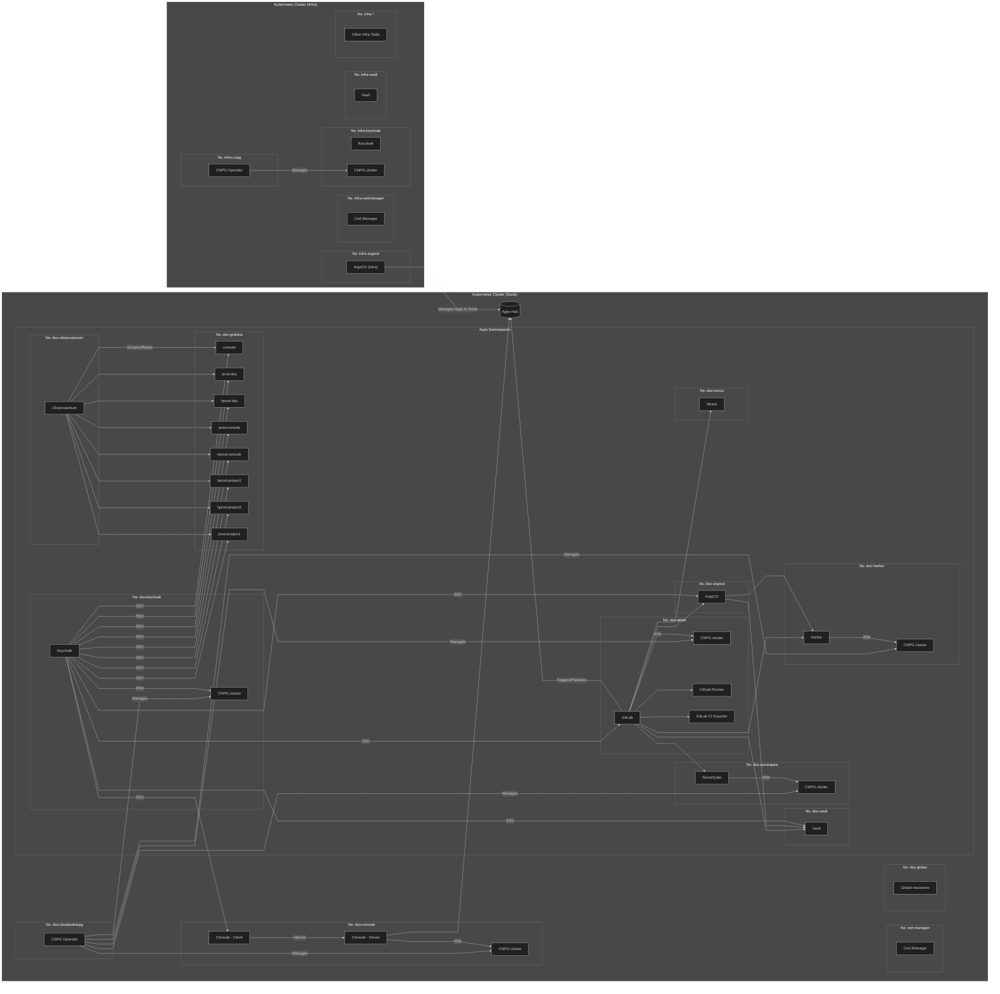

# Socle de la plateforme Cloud π Native <!-- omit in toc -->

## Sommaire <!-- omit in toc -->

- [Introduction](#introduction)
- [Architecture](#architecture)
- [Installation](#installation)
- [Migration vers le déploiement GitOps](#migration-vers-le-déploiement-gitops)
  - [Harbor GitOps](#harbor-gitops)
  - [Nexus GitOps](#nexus-gitops)
- [Déploiement de plusieurs forges DSO dans un même cluster](#déploiement-de-plusieurs-forges-dso-dans-un-même-cluster)
- [Récupération des secrets](#récupération-des-secrets)
- [Debug](#debug)
  - [Cert-manager](#cert-manager)
  - [Kyverno](#kyverno)
  - [Prometheus](#prometheus)
- [Gel des versions](#gel-des-versions)
  - [Introduction](#introduction-1)
  - [Modification des versions de charts](#modification-des-versions-de-charts)
  - [Gel des versions d'images](#gel-des-versions-dimages)
    - [Argo CD](#argo-cd)
    - [Cert-manager](#cert-manager-1)
    - [CloudNativePG](#cloudnativepg)
    - [Console Cloud π Native](#console-cloud-π-native)
    - [GitLab](#gitlab)
    - [GitLab CI pipelines exporter](#gitlab-ci-pipelines-exporter)
    - [GitLab Runner](#gitlab-runner)
    - [Harbor](#harbor)
    - [Keycloak](#keycloak)
    - [Kyverno](#kyverno-1)
    - [Sonatype Nexus Repository](#sonatype-nexus-repository)
    - [SonarQube Community Edition](#sonarqube-community-edition)
    - [Vault](#vault)
- [Backups](#backups)
- [Offline / air gap](#offline--air-gap)
- [Platform](#platform)
- [Profile CIS](#profile-cis)
- [Utilisation de credentials Docker Hub pour le pull des images](#utilisation-de-credentials-docker-hub-pour-le-pull-des-images)
- [Gestion des users Keycloak](#gestion-des-users-keycloak)
- [MFA pour les utilisateurs Keycloak](#mfa-pour-les-utilisateurs-keycloak)
- [Tests d'intégration](#tests-dintégration)
- [Contributions](#contributions)
  - [Les commandes de l'application](#les-commandes-de-lapplication)
  - [Conventions](#conventions)

## Introduction

Le socle de la plateforme Cloud π Native (aussi appelée `DSO` pour `DevSecOps`) est composé de plusieurs composants, qui s'appuient sur des outils open source tels que Kubernetes, Helm, Ansible, GitLab, etc...

Les éléments déployés seront les suivants :

| Outil | Site officiel |
| -|-|
| Argo CD | <https://argo-cd.readthedocs.io> |
| Cert-manager | <https://cert-manager.io> |
| CloudNativePG | <https://cloudnative-pg.io> |
| Console Cloud π Native | <https://github.com/cloud-pi-native/console> |
| GitLab | <https://about.gitlab.com> |
| gitLab-ci-catalog | <https://github.com/cloud-pi-native/gitlab-ci-catalog> |
| gitLab-ci-pipelines-exporter | <https://github.com/mvisonneau/helm-charts/tree/main/charts/gitlab-ci-pipelines-exporter> |
| GitLab Operator | <https://docs.gitlab.com/operator> |
| GitLab Runner | <https://docs.gitlab.com/runner> |
| Grafana (optionnel) | <https://grafana.com> |
| Harbor | <https://goharbor.io> |
| HashiCorp Vault | <https://www.vaultproject.io> |
| Keycloak | <https://www.keycloak.org> |
| Kyverno | <https://kyverno.io> |
| Prometheus Operator CRDs (optionnel) | <https://github.com/prometheus-operator/prometheus-operator/releases><br>Fichier `stripped-down-crds.yaml` disponible dans les Assets de chaque version. |
| SonarQube Community Edition | <https://www.sonarsource.com/open-source-editions/sonarqube-community-edition> |
| Sonatype Nexus Repository | <https://www.sonatype.com/products/sonatype-nexus-repository> |

Certains outils peuvent prendre un peu de temps pour s'installer. Ce sera le cas de Keycloak, Nexus, SonarQube et en particulier GitLab.

Vous pouvez trouver la version des outils installés dans le fichier [versions.md](versions.md).

Comme précisé dans le tableau ci-dessus, certains éléments sont optionnels :
* L'opérateur Grafana et l'instance Grafana ne s'installeront que sur demande explicite, via l'utilisation des tags appropriés. Ceci afin de vous permettre d'opter ou non pour cette solution d'affichage des métriques.
* Les CRDs de l'opérateur Prometheus ne s'installent que s'il est déjà présent dans le cluster (paramètre `managed` dans notre configuration).

## Architecture



## Installation

Nous proposons dès maintenant un mode d'installation s'appuyant sur l'approche [GitOps](https://en.wikipedia.org/wiki/DevOps#GitOps), et reposant sur une application Argo CD qui déploie plusieurs [applicationSets](https://argo-cd.readthedocs.io/en/stable/user-guide/application-set/) par vagues (notion de [sync waves](https://argo-cd.readthedocs.io/en/stable/user-guide/sync-waves/)). Chaque applicationSet déploie lui-même une ou plusieurs applications du Socle, selon la vague à laquelle elles sont rattachées, ceci en fonction d'un environnement donné et des paramètres qui le caractérisent.

Toutes les applications de la chaîne DSO sont désormais gérées en mode GitOps.

Veuillez consulter le [INSTALL.md](/INSTALL.md) du répertoire socle pour plus de détails.

## Migration vers le déploiement GitOps

:warning: Assurez-vous de ne pas perdre le mot de passe admin de Nexus avant d'effectuer la synchronisation Argo CD.

Après la synchronisation Argo CD, pour tous les services, il sera nécessaire de supprimer les deployments, statefulsets et jobs parce qu'il y a nécessité de modification des champs immuables `spec.selector.matchLabels` lors de la prise d'ownership d'Argo CD.
Ceci peut être fait avec la commande suivante en se positionnant sur les namespaces concernés.
```shell
kubectl config set-context --current --namespace=<namespace>
kubectl get deploy | grep -v NAME | awk '{print $1}' | xargs --no-run-if-empty kubectl delete deploy && kubectl get sts | grep -v NAME | awk '{print $1}' | xargs --no-run-if-empty kubectl delete sts && kubectl get job | grep -v NAME | awk '{print $1}' | xargs --no-run-if-empty kubectl delete job
```

### Harbor GitOps

En cas d'utilisation de `imageChartStorage` dans la `dsc` comme suit.
```yaml
harbor:
  values:
    persistence:
      imageChartStorage:
        s3:
          accesskey: <accesskey>
          bucket: <bucket>
          region: <region>
          regionendpoint: <regionendpoint>
          secretkey: <secretkey>
        type: s3
```
Il faut supprimer et remplacer par ce qui suit.
```yaml
harbor:
  s3ImageChartStorage:
    enabled: true
    accesskey: <accesskey>
    bucket: <bucket>
    region: <region>
    regionendpoint: <regionendpoint>
    secretkey: <secretkey>
```
Puis lancer le playbook d'insertion des secrets dans le Vault d'infrastructure.
```shell
ansible-playbook install-gitops.yaml -t vault-secrets
```

### Nexus GitOps

Il y a une migration de données à faire. Pour cela, il faut modifier le Statefulset Nexus de la manière suivante (désactiver l'auto-sync sur Argo CD si nécessaire) :
- monter l'ancien volume existant,
- modifier l'image du Statefulset et ajouter la commande de `sleep infinity` pour maintenir le conteneur en vie sans que Nexus ne s'exécute.
```yaml
spec:
  template:
    spec:
      [...]
      containers:
        image: busybox
        command: ["sleep", "infinity"]
        [...]
        volumeMounts:
        - mountPath: /nexus-data-claim
          name: nexus-data-claim
      [...]
      volumes:
      - name: nexus-data-claim
        persistentVolumeClaim:
          claimName: nexus-data-claim
```
Une fois le pod en `running 3/4`, il faudra exec dans le pod et faire la copie des répertoires suivants.
```
cp -rp /nexus-data-claim/blobs /nexus-data/
cp -rp /nexus-data-claim/db /nexus-data/
cp -rp /nexus-data-claim/etc /nexus-data/
cp -rp /nexus-data-claim/keystores /nexus-data/

# Optionnel:
cp -rp /nexus-data-claim/log /nexus-data/
cp -rp /nexus-data-claim/cache /nexus-data/
cp -rp /nexus-data-claim/elasticsearch /nexus-data/
```
Synchroniser l'application Argo CD pour que Nexus démarre avec les données migrées et supprimer l'ancien pvc (assurez-vous que le mot de passe Admin sur Vault soit bien celui d'avant migration).

## Déploiement de plusieurs forges DSO dans un même cluster

Suite à une première installation réussie et selon vos besoins, il est possible, selon sa capacité, d'installer dans un même cluster une ou plusieurs autres forges DSO, en parallèle de celle installée par défaut.

Pour cela, il vous suffit de déclarer une **nouvelle ressource de type dsc dans le cluster**, en la nommant différemment de la ressource `dsc` par défaut qui pour rappel se nomme `conf-dso`, et en y modifiant les éléments souhaités.

Comme vu plus haut dans la section [Configuration](#configuration), déclarez votre ressource de type `dsc` personnalisée **dans un fichier YAML**.

Il s'agira simplement de **modifier le nom de la ressource dsc** (section `metadata`, champ `name`) puis **adapter les paramètres souhaités** (mots de passe, ingress, CA, proxy, values …).

Pensez également à déclarer pour chaque outil **un `namespace` et un `subDomain` différents** de ceux déjà déclarés lors de la première installation du socle DSO.

Exemple pour Argo CD :

```yaml
argocd:
  namespace: mynamespace-argocd
  subDomain: argocd-perso
  admin:
    enabled: true
    password: PasswordForEveryone
```

Pour mémoire, les namespaces et subDomains par défaut, déclarés lors de la première installation du socle, peuvent être listés en se positionnant préalablement dans le répertoire socle, puis en affichant le fichier « config.yaml » du role socle-config, exemple en ligne de commande :

```bash
cat ./roles/socle-config/files/config.yaml
```

Lorsque votre nouvelle configuration est prête, et déclarée par exemple dans le fichier « ma-conf-perso.yaml », créez-la dans le cluster comme ceci :

```bash
kubectl apply -f ma-conf-perso.yaml
```

Vous pourrez ensuite la retrouver via la commande :

```bash
kubectl get dsc
```

Puis éventuellement l'afficher (exemple avec une `dsc` nommée `ma-dsc`) :

```bash
kubectl get dsc ma-dsc -o yaml
```

Dès lors, il vous sera possible de déployer une nouvelle chaîne DSO dans ce cluster, en plus de celle existante. Pour cela, vous utiliserez l'[extra variable](https://docs.ansible.com/ansible/latest/playbook_guide/playbooks_variables.html#defining-variables-at-runtime) Ansible prévue à cet effet, nommée `dsc_cr` (pour DSO Socle Config Custom Resource).

Par exemple, si votre nouvelle ressource `dsc` se nomme `ma-dsc`, alors vous lancerez l'installation correspondante comme ceci :

```bash
ansible-playbook install-gitops.yaml -e dsc_cr=ma-dsc
```

Pendant l'installation, et si vous avez nommé vos namespaces en utilisant un même suffixe ou préfixe, vous pourrez surveiller l'arrivée de ces namespaces dans le cluster.

Exemple avec des namespaces préfixés `mynamespace-` :

```bash
watch "kubectl get ns | grep 'mynamespace-'"
```

Exemple avec des namespaces dont le suffixe est `-mynamespace` :

```bash
watch "kubectl get ns | grep '\-mynamespace'"
```

## Récupération des secrets

Au moment de leur initialisation, certains outils stockent des secrets qui ne sont en principe plus disponibles ultérieurement.

**Attention !** Pour garantir l'[idempotence](https://fr.wikipedia.org/wiki/Idempotence), ces secrets sont stockés dans plusieurs ressources du cluster. Supprimer ces ressources **indique à Ansible qu'il doit réinitialiser les composants associés**.

Afin de faciliter la récupération des secrets, un playbook d'administration nommé `get-credentials.yaml` est mis à disposition dans le répertoire `admin-tools/`.

Pour le lancer :

```bash
ansible-playbook admin-tools/get-credentials.yaml
```

Ce playbook permet également de cibler un outil en particulier, grâce à l'utilisation de tags qui sont listés au début de l'exécution, exemple avec keycloak :

```bash
ansible-playbook admin-tools/get-credentials.yaml -t keycloak
```

Enfin, dans le cas où plusieurs chaînes DSO sont déployées dans le même cluster, il permet de cibler la chaîne DSO voulue via l'utilisation de l'[extra variable](https://docs.ansible.com/ansible/latest/playbook_guide/playbooks_variables.html#defining-variables-at-runtime) `dsc_cr`, exemple avec une chaîne utilisant la `dsc` nommée `ma-conf` :

```bash
ansible-playbook admin-tools/get-credentials.yaml -e dsc_cr=ma-conf
```

Et bien sûr cibler un ou plusieurs outils en même temps, via les tags. Exemple :

```bash
ansible-playbook admin-tools/get-credentials.yaml -e dsc_cr=ma-conf -t keycloak,argocd
```

**Remarque importante** : Il est **vivement encouragé** de **sauvegarder les valeurs** qui vous sont fournies par le playbook `get-credentials.yaml`. Par exemple dans un fichier de base de données chiffré de type KeePass, Vaultwarden ou Bitwarden. Il est toutefois important de **ne pas les modifier ou les supprimer** sous peine de voir certains composants, par exemple Vault, être réinitialisés.

## Debug

### Cert-manager

L'outil cert-manager est installé à l'aide de son [chart helm officiel](https://cert-manager.io/docs/installation/helm), en GitOps.

Le playbook d'installation, en s'appuyant sur le role `check-prerequisite`, s'assurera préalablement qu'il n'est pas déjà installé dans le cluster. Il vérifiera pour cela la présence de deux éléments :

- L'APIVERSION `cert-manager.io/v1`.
- La `MutatingWebhookConfiguration` nommée `cert-manager-webhook`.

Si l'un ou l'autre de ces éléments sont absents du cluster, cela signifie que cert-manager n'est pas installé. Le rôle associé procédera donc à son installation.

**Attention !** Assurez-vous que si une précédente instance de cert-manager a été désinstallée du cluster, elle l'a été proprement. En effet, si l'outil avait déjà été installé auparavant, mais qu'il n'a pas été correctement désinstallé au préalable, alors il est possible que les deux ressources vérifiées par le role soient toujours présentes. Dans ce cas de figure, et si un ingress avec tls de type acme est déclaré dans votre ressource `dsc`, les déploiements de ressources ingress et les routes associées échoueront à se créer, car cert-manager n'aura pas été installé par le role.

### Kyverno

Kyverno est installé en GitOps. Il est utilisé pour déployer une ClusterPolicy qui automatise la réplication des secrets et configmaps portant le label `ns.kyverno.io/all-sync: ""` dans tous les namespaces de la chaîne DSO.

Pour l'instant, seuls les secrets et configmaps présents dans le namespace `{{ dsc.global.namespace }}` et portant ce label sont ainsi répliqués.

### Prometheus

Les tâches du rôle prometheus ne se lancent que si le paramètre `prometheus.crd.type` de la `dsc` est positionné sur `managed` comme dans l'exemple suivant :

```yaml
prometheus:
  crd:
    type: managed
```

Il faudra positionner cette valeur `managed` dans le cas de figure où l'opérateur Prometheus est installé dans notre cluster.

Le rôle en lui-même sert à installer séparément les CRDs de l'opérateur Prometheus, ce qui est recommandé en production.


## Gel des versions

### Introduction

Selon le type d'infrastructure dans laquelle vous déployez, et **en particulier dans un environnement de production**, vous voudrez certainement pouvoir geler (freeze) les versions d'outils ou composants utilisés.

Pour chaque version du socle DSO, les numéros de version de charts utilisés sont gelés par défaut.

Ils peuvent être consultés dans le fichier [versions.md](versions.md), situé à la racine du présent dépôt socle que vous avez initialement cloné.

Vous pouvez également geler les versions d'images utilisées par les charts Helm de chaque outil.

Ceci est géré par le champ `values` que vous pourrez spécifier, pour chaque outil concerné, dans la ressource `dsc` de configuration par défaut (`conf-dso`) ou votre propre `dsc`.

Les sections suivantes détaillent comment procéder, outil par outil.

**Remarques importantes** :

- Comme vu dans la section d'installation (sous-section [Déploiement de plusieurs forges DSO dans un même cluster](#déploiement-de-plusieurs-forges-dso-dans-un-même-cluster )), si vous utilisez votre propre ressource `dsc` de configuration, distincte de `conf-dso`, alors toutes les commandes `ansible-playbook` indiquées ci-dessous devront être complétées par la [variable supplémentaire](https://docs.ansible.com/ansible/latest/playbook_guide/playbooks_variables.html#defining-variables-at-runtime) `dsc_cr` appropriée (via l'option `--extra-vars` ou `-e`).
- Pour le gel des versions d'images, il est recommandé, si possible, de positionner un **tag d'image en adéquation avec la version du chart Helm utilisé**, c'est-à-dire d'utiliser le numéro `APP VERSION` retourné par la commande `helm search repo`.

### Modification des versions de charts

Techniquement, la modification des versions de charts utilisés est possible, mais elle **n'est pas recommandée**.

Ceci parce que la version de la Console Cloud π Native déployée par le socle, composant central qui s'interface avec tous les outils de la chaîne, a été testée et développée avec les versions d'outils telles qu'elles sont fixées au moment de la publication.

Aussi, **nous ne pouvons garantir le bon fonctionnement** de la forge DSO dans un contexte avec lequel les versions de charts seraient modifiées.

De plus, et comme indiqué plus haut, les outils cert-manager, CloudNativePG, GitLab Operator et Kyverno seront communs à toutes les instances de la chaine DSO ou à toute autre application déployée dans le cluster. En modifier la version n'est donc pas anodin.

Si vous souhaitez malgré tout tenter une modification de version d'un chart en particulier, vous devrez **avoir au moins installé le socle DSO une première fois**. En effet, le playbook et les roles associés installeront les dépôts Helm de chaque outil. Ceci vous permettra ensuite d'utiliser la commande `helm` pour rechercher plus facilement les versions de charts disponibles.

Pensez également à effectuer au moins un backup du namespace et des ressources cluster scoped associées.

Vous devrez ensuite **afficher le fichier « releases.yaml »** du role `socle-config` afin de connaître le nom du champ à insérer dans la `dsc` et le numéro de version de chart par défaut pour l'outil concerné.

Une fois que nous sommes positionnés dans le répertoire socle, la commande pour afficher ce fichier sera :

```bash
cat ./roles/socle-config/files/releases.yaml
```

Pour connaître la dernière version du chart Helm et de l'application actuellement utilisée dans votre cluster, référez-vous aux valeurs inscrite dans votre source de vérité.

Pour fixer une version de chart dans la ressource `dsc`, il vous suffira d'ajouter la ligne que vous aurez trouvée dans le fichier « releases.yaml » vu plus haut, au niveau de l'outil concerné, exemple pour Argo CD :

```yaml
argocd:
  chartVersion: 4.7.19
```

### Gel des versions d'images

Comme indiqué précédemment, le gel des versions d'images peut être géré par le champ `values` que vous pourrez spécifier, pour chaque outil concerné, dans la ressource `dsc` de configuration par défaut (`conf-dso`) ou votre propre `dsc`.

Ce champ correspond rigoureusement à ce qui est utilisable pour une version donnée du chart Helm de l'outil en question.

Pour certains outils (instance grafana, nexus), l'image est fixée par défaut et nous proposons directement un champ dédié dans la `dsc`.

Si vous souhaitez connaître le champ en question, il vous suffit d'afficher le fichier « releases.yaml »** du role `socle-config`.

Rappel : une fois que nous sommes positionnés dans le répertoire socle, la commande pour afficher ce fichier sera la suivante.

```bash
cat ./roles/socle-config/files/releases.yaml
```

Lors d'une **première installation du socle**, nous vous recommandons toutefois de **ne pas geler immédiatement vos versions d'images dans la `dsc`**. En effet, le playbook et les roles associés installeront les dépôts Helm de chaque outil et utiliseront la version d'image qui correspond à la version du chart définie par défaut.

Ceci vous permettra ensuite d'utiliser la commande `helm` pour rechercher plus facilement les versions d'images disponibles et à quelles versions de charts, elles sont associées.

Lorsque vous gelez vos images dans la `dsc`, il est **fortement recommandé** d'utiliser un tag d'image en adéquation avec la version de chart utilisée, tel que fourni par la commande `helm search repo -l nom-de-mon-outil-ici --version version-de-chart-ici`.

Lorsque vos values sont à jour **pour tous les outils concernés**, avec les versions d'images désirées, appliquez le changement en utilisant votre fichier de définition. Exemple :

```bash
kubectl apply -f ma-conf-dso.yaml
```

Puis relancez l'[Installation](#installation).

Les sections suivantes détaillent la façon de procéder au gel de version d'image pour chaque outil :
  - [Argo CD](#argo-cd)
  - [Cert-manager](#cert-manager)
  - [CloudNativePG](#cloudnativepg-1)
  - [Console Cloud π Native](#console-cloud-π-native)
  - [GitLab](#gitlab)
  - [GitLab Runner](#gitlab-runner)
  - [Harbor](#harbor)
  - [Keycloak](#keycloak)
  - [Kyverno](#kyverno-1)
  - [Sonatype Nexus Repository](#sonatype-nexus-repository)
  - [SonarQube Community Edition](#sonarqube-community-edition)
  - [Vault](#vault)

#### Argo CD

Le composant Argo CD est installé à l'aide de son chart Helm officiel.

La version d'image utilisée est directement liée à la version de chart déployée. Elle est donc déjà gelée par défaut.

Il est recommandé de ne pas modifier cette version de chart, sauf si vous savez ce que vous faites.

#### Cert-manager

La version d'image utilisée par cert-manager est directement liée à la version de chart déployée. Elle est donc déjà gelée par défaut.

Il est recommandé de ne pas modifier cette version de chart, sauf si vous savez ce que vous faites.

#### CloudNativePG

Comme avec cert-manager, il existe une correspondance biunivoque entre la version de chart utilisée et la version d'application (`APP VERSION`) de l'opérateur.

Ainsi, spécifier une version de chart est suffisant pour geler la version d'image au niveau de l'opérateur.

Il est recommandé de ne pas modifier cette version de chart, sauf si vous savez ce que vous faites.

Comme indiqué dans sa [documentation officielle](https://cloudnative-pg.io/documentation/1.20/quickstart/#part-3-deploy-a-postgresql-cluster), par défaut CloudNativePG installera la dernière version mineure disponible de la dernière version majeure de PostgreSQL au moment de la publication de l'opérateur.

De plus, comme l'indique la [FAQ officielle](https://cloudnative-pg.io/documentation/1.20/faq/), CloudNativePG utilise des conteneurs d'application immuables. Cela signifie que le conteneur ne sera pas modifié durant tout son cycle de vie (aucun patch, aucune mise à jour ni changement de configuration).

#### Console Cloud π Native

La version d'image utilisée par la Console Cloud π Native est directement liée à la version de chart déployée. Elle est donc déjà gelée par défaut.

Il est recommandé de ne pas modifier cette version de chart, sauf si vous savez ce que vous faites.

#### GitLab

La version d'image utilisée par GitLab est directement liée à la version de chart déployée. Elle est donc déjà gelée par défaut.

Par ailleurs le chart Helm de GitLab est déployé via l'opérateur GitLab, lui-même déployé via Helm.

Il existe ainsi une correspondance directe entre la version de chart utilisée pour déployer l'opérateur et les versions de charts GitLab que cet opérateur sera en mesure d'installer.

Cette correspondance est fournie par la page de documentation suivante :

https://gitlab.com/gitlab-org/cloud-native/gitlab-operator/-/tags

Dans le même ordre d'idée, une version de chart GitLab correspond à une version d'instance GitLab.

La correspondance entre versions de charts GitLab et versions d'instances Gitlab est fournie par la page de documentation suivante :

https://docs.gitlab.com/charts/installation/version_mappings.html

Il est donc recommandé de ne pas modifier les versions de charts déjà fixées au moment de la sortie du socle, sauf si vous savez ce que vous faites. Dans le cas où vous souhaiteriez les modifier, gardez à l'esprit les correspondances signalées précédemment, entre version du chart de l'opérateur et versions de chart GitLab qu'il peut installer.

#### GitLab CI pipelines exporter

La version d'image utilisée par _GitLab CI pipelines exporter_ est directement liée à la version de chart déployée. Elle est donc déjà gelée par défaut.

Il est recommandé de ne pas modifier cette version de chart, sauf si vous savez ce que vous faites.

#### GitLab Runner

La version d'image utilisée par GitLab Runner est directement liée à la version de chart déployée. Elle est donc déjà gelée par défaut.

Il est recommandé de ne pas modifier cette version de chart, sauf si vous savez ce que vous faites.

Si toutefois vous souhaitez la modifier, sachez que la version `majeure.mineure` de l'instance GitLab Runner doit idéalement correspondre à celle de l'instance GitLab, comme expliqué ici :

https://docs.gitlab.com/runner/#gitlab-runner-versions

#### Harbor

Fixer le numéro de version du chart Helm sera normalement suffisant pour fixer aussi le numéro de version des images associées. Le numéro de version de ces images sera celui visible dans la colonne `APP VERSION` de la commande `helm search repo -l harbor/harbor`.

Il est toutefois possible de fixer les versions d'images pour Harbor de façon plus fine (**recommandé en production**).

Il sera ainsi possible de fixer l'image de chacun des composants.

Les différents tags utilisables sont disponibles ici :

- nginx : <https://hub.docker.com/r/goharbor/nginx-photon/tags>
- portal : <https://hub.docker.com/r/goharbor/harbor-portal/tags>
- core : <https://hub.docker.com/r/goharbor/harbor-core/tags>
- jobservice : <https://hub.docker.com/r/goharbor/harbor-jobservice/tags>
- registry (registry) : <https://hub.docker.com/r/goharbor/registry-photon/tags>
- registry (controller) : <https://hub.docker.com/r/goharbor/harbor-registryctl/tags>
- trivy : <https://hub.docker.com/r/goharbor/trivy-adapter-photon/tags>
- notary (server) : <https://hub.docker.com/r/goharbor/notary-server-photon/tags>
- notary (signer) : <https://hub.docker.com/r/goharbor/notary-signer-photon/tags>
- database : <https://hub.docker.com/r/goharbor/harbor-db/tags>
- redis : <https://hub.docker.com/r/goharbor/redis-photon/tags>
- exporter : <https://hub.docker.com/r/goharbor/harbor-exporter/tags>

**Rappel** : Il est néanmoins recommandé de positionner des tags d'images en adéquation avec la version du chart Helm utilisée et documentée dans le fichier [versions.md](versions.md), situé à la racine du socle, c'est-à-dire d'utiliser le numéro `APP VERSION` retourné par la commande `helm search repo -l harbor/harbor --version numero-de-version-de-chart`.

Pour spécifier nos tags, il nous suffira d'éditer la ressource `dsc` de configuration (par défaut, ce sera la `dsc` nommée `conf-dso`) et de surcharger les "values" correspondantes du chart Helm, en ajoutant celles dont nous avons besoin. Exemple, pour la version 1.14.1 du chart :

```yaml
harbor:
  adminPassword: WhoWantsToPassForever
  pvcRegistrySize: 50Gi
  values:
    nginx:
      image:
        repository: docker.io/goharbor/nginx-photon
        tag: v2.10.1
    portal:
      image:
        repository: docker.io/goharbor/harbor-portal
        tag: v2.10.1
    core:
      image:
        repository: docker.io/goharbor/harbor-core
        tag: v2.10.1
    jobservice:
      image:
        repository: docker.io/goharbor/harbor-jobservice
        tag: v2.10.1
    registry:
      registry:
        image:
          repository: docker.io/goharbor/registry-photon
          tag: v2.10.1
      controller:
        image:
          repository: docker.io/goharbor/harbor-registryctl
          tag: v2.10.1
    trivy:
      image:
        repository: docker.io/goharbor/trivy-adapter-photon
        tag: v2.10.1
    notary:
      server:
        image:
          repository: docker.io/goharbor/notary-server-photon
          tag: v2.10.1
      signer:
        image:
          repository: docker.io/goharbor/notary-signer-photon
          tag: v2.10.1
    database:
      internal:
        image:
          repository: docker.io/goharbor/harbor-db
          tag: v2.10.1
    redis:
      internal:
        image:
          repository: docker.io/goharbor/redis-photon
          tag: v2.10.1
    exporter:
      image:
        repository: docker.io/goharbor/harbor-exporter
        tag: v2.10.1
```

Pour mémoire, les values utilisables sont disponibles et documentées ici : <https://github.com/goharbor/harbor-helm/tree/master>

#### Keycloak

Le composant Keycloak est installé à l'aide du chart Helm Bitnami.

Nous utiliserons un tag dit "[immutable](https://docs.bitnami.com/kubernetes/apps/keycloak/configuration/understand-rolling-immutable-tags/)" (**recommandé en production**).

Les différents tags utilisables pour l'image de Keycloak sont disponibles ici : <https://hub.docker.com/r/bitnami/keycloak/tags>

Les _immutable tags_ sont ceux qui possèdent un suffixe de type rXX, lequel correspond au numéro de révision. Ils pointent toujours vers la même image. Par exemple, `19.0.3-debian-11-r22` est un _immutable tag_.

Pour spécifier un tel tag, il nous suffira d'éditer la ressource `dsc` de configuration (par défaut, ce sera la `dsc` nommée `conf-dso`) et de surcharger les "values" correspondantes du chart Helm, en ajoutant celles dont nous avons besoin. Exemple :

```yaml
keycloak:
  values:
    image:
      registry: docker.io
      repository: bitnami/keycloak
      tag: 26.1.3-debian-12-r0
```

Pour mémoire, les values utilisables sont disponibles ici : <https://github.com/bitnami/charts/blob/main/bitnami/keycloak/values.yaml>

Les release notes de Keycloak se trouvent ici : <https://github.com/keycloak/keycloak/releases>

#### Kyverno

La version d'image utilisée par Kyverno est directement liée à la version de chart déployée. Elle est donc déjà gelée par défaut.

Il est recommandé de ne pas modifier cette version de chart, sauf si vous savez ce que vous faites.

#### Sonatype Nexus Repository

Le composant nexus est installé directement via le manifest de deployment « nexus.yml.j2 » intégré au role associé.

L'image utilisée est déjà gelée. Son numéro de version est spécifié dans le fichier [versions.md](versions.md) situé à la racine du socle.

Il est recommandé de ne pas modifier cette version, sauf si vous savez ce que vous faites.

Si toutefois vous souhaitez la modifier, les tags d'images utilisables sont disponibles ici : <https://hub.docker.com/r/sonatype/nexus3/tags>

Pour déployer une autre version, il suffira d'éditer la `dsc`, de préférence avec le fichier YAML que vous avez initialement utilisé pendant l'installation, puis modifier la section suivante en y indiquant la version d'image désirée au niveau du paramètre **imageTag**. Exemple :

```yaml
nexus:
  storageSize: 25Gi
  imageTag: 3.68.1
```

#### SonarQube Community Edition

Le composant SonarQube est installé via son [chart Helm officiel](https://github.com/SonarSource/helm-chart-sonarqube/tree/master/charts/sonarqube).

Les tags d'images utilisables sont ceux retournés par la commande suivante, au niveau de la colonne `APP VERSION` :

```bash
helm search repo -l sonarqube/sonarqube
```

Il faudra juste leur ajouter le suffixe `-community` qui correspond à l'édition utilisée, ou bien le suffixe `-{{ .Values.edition }}` si nous précisons aussi l'édition dans nos values.

Pour spécifier un tel tag, il nous suffira d'éditer la ressource `dsc` de configuration (par défaut, ce sera la `dsc` nommée `conf-dso`) et de surcharger les "values" correspondantes du chart Helm, en ajoutant celles dont nous avons besoin. Exemple :

```yaml
sonarqube:
  postgresPvcSize: 25Gi
  values:
    image:
      registry: docker.io
      repository: sonarqube
      edition: community
      tag: 10.8.1-{{ .Values.edition }}
```

#### Vault

Fixer les versions d'images de Vault est **recommandé en production**.

Les values utilisables sont disponibles et documentées ici : <https://developer.hashicorp.com/vault/docs/platform/k8s/helm/configuration>

Il sera possible de fixer l'image :
- du Vault Agent Sidecar Injector (via le repository hashicorp/vault-k8s),
- du Vault Agent (via le repository hashicorp/vault).

Les différents tags d'images utilisables sont disponibles ici :
- Pour le Vault Agent Sidecar Injector : <https://hub.docker.com/r/hashicorp/vault-k8s/tags>
- Pour le Vault Agent : <https://hub.docker.com/r/hashicorp/vault/tags>

Pour spécifier nos tags, il nous suffira d'éditer la ressource `dsc` de configuration (par défaut, ce sera la `dsc` nommée `conf-dso`) et de surcharger les "values" correspondantes du chart Helm, en ajoutant celles dont nous avons besoin. Exemple :

```yaml
vault:
  values:
    injector:
      image:
        repository: docker.io/hashicorp/vault-k8s
        tag: 1.5.0
        pullPolicy: IfNotPresent
      agentImage:
        repository: docker.io/hashicorp/vault
        tag: 1.18.1
    server:
      image:
        repository: docker.io/hashicorp/vault
        tag: 1.18.1
        pullPolicy: IfNotPresent
      updateStrategyType: RollingUpdate
```

**Remarque importante** : En cas de tentative de mise à jour des versions d'images, dans la section `server` de vos values, le paramètre `updateStrategyType` doit impérativement être présent et positionné sur "RollingUpdate" pour que l'image du serveur Vault puisse éventuellement se mettre à jour avec le tag que vous avez indiqué.

## Backups

Selon les possibilités de votre cluster, nous proposons dans la resource `dsc` de configuration différentes options de backup :
* Backup des namespaces avec Velero.
* Backup dans un bucket S3 des BDD PostgreSQL déployées via CNPG.

Ceci est géré au niveau du paramètre `global.backup`.

Vous pouvez obtenir plus de renseignements sur le paramétrage des champs de backup proposés via les commandes suivantes.

Pour les backups de namespaces avec Velero :

```shell
kubectl explain dsc.spec.global.backup.velero
```

Pour les backups S3 des BDD PostgreSQL déployées via CNPG :

```shell
kubectl explain dsc.spec.global.backup.cnpg
```

## Offline / air gap

En mode air gap ou déconnecté d'internet, certaines valeurs de la `dsc` devront être adaptées.
- `dsc.sonarqube` :
  - `pluginDownloadUrl` et `prometheusJavaagentVersion`
- `dsc.gitlabCatalog.catalogRepoUrl`
- `dsc.argocd.privateGitlabDomain`
- `dsc.grafanaOperator.ociChartUrl`
- `helmRepoUrl` pour chaque service à savoir :
  - `argocd`, `certmanager`, `cloudnativepg`, `console`, `glexporter`, `gitlabOperator`, `gitlabrunner`, `harbor`, `keycloak`, `kyverno`, `sonarqube` et `vault`
- `dsc.awx.repoSocle.url` (et optionnellement : `dsc.awx.repoSocle.revision`)

## Platform

Par défaut, le déploiement du socle DSO se fait sur un cluster de la famille Openshift, mais il est possible de déployer sur les autres types de distribution Kubernetes (Vanilla, K3s, RKE2, EKS, GKE...) en spécifiant comme suit dans la dsc.
```
platform: kubernetes
```

## Profile CIS

Pour un déploiement sur un cluster qui n'est pas de la famille d'Openshift, par exemple sur un Kubernetes Vanilla, il est possible d'activer le profil de sécurité CIS pour enforcer la partie securityContext, en spécifiant comme suit dans la dsc.
```
profile: cis
```

## Utilisation de credentials Docker Hub pour le pull des images

Si vous disposez d'un compte Docker Hub, il est possible de l'utiliser pour le pull d'images des outils de la plateforme elle-même.

Ceci peut se révéler utile si vous effectuez de nombreux tests d'installation, et que vous vous retrouvez confronté à la problématique des [pull rate limits](https://www.docker.com/increase-rate-limits) de Docker Hub.

Pour cela, générez tout d'abord un secret de type `kubernetes.io/dockerconfigjson` en mode dry run et qui contiendra vos identifiants Docker Hub.

Vous en récupérerez le contenu encodé en base64, en une seule fois, via la commande suivante (à adapter avec vos identifiants) :

```bash
k create secret docker-registry docker-hub-creds \
    --docker-server="https://index.docker.io/v1/" \
    --docker-username="email@example.com" \
    --docker-password="mot_de_passe_ici" \
    --docker-email="email@example.com" \
    --dry-run=client \
    -o yaml \
    | yq '.data[.dockerconfigjson]'
```

Notez que du fait de l'utilisation de l'option `dry-run`, le secret n'est pas véritablement créé. La partie qui nous intéresse, encodée en base64, est simplement affichée sur la sortie standard.

Copiez cette sortie, et collez-la dans la section `spec.global.imagePullSecretsData` de votre resource dsc (par défaut `conf-dso`), exemple :

```yaml
global:
  imagePullSecretsData: valeur_récupérée_ici
```

Une fois le changement appliqué à la dsc, relancez l'installation de l'outil souhaité ou de la chaîne DSO complète. Le processus d'installation va maintenant s'appuyer sur le secret `dso-config-pull-secret` créé dans le namespace `default`, utilisant vos identifiants Docker Hub, et répliqué dans le namespace de chaque outil.

Si vous constatez que la réplication du secret n'a pas lieu ou qu'elle prend trop de temps, supprimez préalablement la ClusterPolicy Kyverno `replace-kubed` :

```bash
kubectl delete cpol replace-kubed
```

Puis relancez l'installation de Kyverno, qui va simplement recréer et appliquer immédiatement la policy :

```bash
ansible-playbook install-gitops.yaml -t kyverno
```

Vérifiez la présence du secret `dso-config-pull-secret` dans le(s) namespace(s) souhaité(s) :

```bash
kubectl get secrets -A | egrep 'NAME|dso-config-pull-secret'
```

Puis relancez l'installation de l'outil voulu ou de la chaîne complète.

## Gestion des users Keycloak

Il est possible de gérer la création des users dans le realm applicatif (dso) en spécifiant le paramètre `dsc.keycloak.usersGitOpsEnabled` à `true`.
Pour migrer vers ce mode de gestion, il est possible d'extraire la liste des utilisateurs existant via un playbook, il suffit de lancer la commande suivante :
```shell
ansible-playbook admin-tools/keycloak-extract-users.yml
```
Vous pourrez ensuite mettre le contenu de l'extraction dans le fichier, du dépôt des values, généré à l'emplacement suivant `"{{ gitops_local_repo }}/{{ dsc.global.gitOps.repo.path }}/envs/{{ item.0.name }}/apps/keycloak/templates/users.yaml"`.

## MFA pour les utilisateurs Keycloak

Le MFA est activé par défaut si le paramètre `dsc.keycloak.usersGitOpsEnabled` est positionné à `true`.
Il sera nécessaire pour activer le MFA sur les utilisateurs existants, de lancer en one-shot le playbook suivant :
```shell
ansible-playbook admin-tools/keycloak-enforce-mfa.yml
```

## Tests d'intégration 

Il est possible d'activer les tests d'intégration sur un environnement en spécifiant le paramètre `dsc.tests.installEnabled` à `true`.  
Les notifications étant pour l'instant uniquement supporté sur Mattermost dans le code, il faudra alors récupérer l'id du channel et le token du bot pour les insérer dans le Vault d'infrastructure.  
Pour ce qui concerne les comptes de tests `testuser@example.com` et `secondtestuser@example.com`, il faudra s'assurer que :
- leurs mots de passe correspondent à ceux qui sont insérés dans le Vault d'infrastructure.
- le MFA n'est pas appliqué.

## Contributions

### Les commandes de l'application

```shell
# Lancer la vérification syntaxique
pnpm install && pnpm run lint

# Lancer le formatage du code
pnpm install && pnpm run format
```

### Conventions

Cf. [Conventions - MIOM Fabrique Numérique](https://docs.fabrique-numerique.fr/conventions/nommage.html).

Les commits doivent suivre la spécification des [Commits Conventionnels](https://www.conventionalcommits.org/en/v1.0.0/), il est possible d'ajouter l'[extension VSCode](https://github.com/vivaxy/vscode-conventional-commits) pour faciliter la création des commits.

Une PR doit être faite avec une branche à jour avec la branche `main` en rebase (et sans merge) avant demande de fusion, et la fusion doit être demandée dans `main`.
